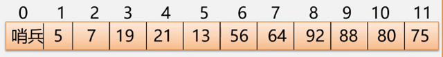

# 查找表、ASL 与顺序查找

原 PDF 对应页：Algorithm.pdf 第 3-5 页。原文从关键字、主关键字、静态/动态查找表、平均查找长度 ASL 讲到顺序查找。Python 版要把“查找成本”变成你能估计复杂度的能力。



## 一句话抓本质

查找就是用关键字定位记录；ASL 衡量平均要比较几次，顺序查找简单但通常慢。

## 查找表是什么

| 概念 | 解释 | Python 例子 |
|---|---|---|
| 记录 | 一条数据 | {"id": 3, "name": "Ann"} |
| 关键字 | 用来找记录的字段 | id |
| 主关键字 | 能唯一定位记录 | 学号、身份证号 |
| 次关键字 | 只能定位一批记录 | 班级、城市 |
| 静态查找表 | 只查，不改 | 排好序的名单 |
| 动态查找表 | 查、插、删都会发生 | 在线用户表 |

## 顺序查找

```python
def linear_search(nums: list[int], target: int) -> int:
    for i, x in enumerate(nums):
        if x == target:
            return i
    return -1

print(linear_search([8, 3, 5, 9], 5))
```

变量角色：

| 变量 | 角色 |
|---|---|
| nums | 待查找表 |
| target | 要找的关键字 |
| i | 当前检查的位置 |
| x | 当前记录或关键字 |

## 手推比较次数

nums = [8, 3, 5, 9]

| target | 比较过程 | 比较次数 |
|---:|---|---:|
| 8 | 8 | 1 |
| 3 | 8, 3 | 2 |
| 5 | 8, 3, 5 | 3 |
| 9 | 8, 3, 5, 9 | 4 |
| 7 | 8, 3, 5, 9 | 4，失败 |

如果每个元素被查到的概率相同，成功查找的平均比较次数是：

```text
(1 + 2 + 3 + ... + n) / n = (n + 1) / 2
```

所以顺序查找是 O(n)。

## 带哨兵的思想

原 PDF 的 C 代码会把 0 号位置留给 guard。Python 里一般不这么写，但思想值得理解：让循环少判断一个条件。

```python
def linear_search_with_sentinel(nums: list[int], target: int) -> int:
    arr = nums[:] + [target]
    i = 0
    while arr[i] != target:
        i += 1
    if i == len(nums):
        return -1
    return i
```

这段不一定比普通 Python 写法更快，但能帮你理解 C 语言里“哨兵”为什么能减少边界判断。

## 如何提高查找效率

| 方法 | 适用条件 | Python 对应 |
|---|---|---|
| 高频元素放前面 | 查找概率不均匀 | 手动维护顺序 |
| 数据有序 | 能排序或本来有序 | 二分查找 |
| 用树结构 | 动态插入删除 | BST / 平衡树思想 |
| 用哈希 | 需要快速按 key 找 | dict / set |

## 常见错法

错误 1：把 for 循环里的 i 当成“第 i 个”。Python 下标从 0 开始，第 1 个元素下标是 0。

错误 2：失败时返回 0。Python 里 0 是合法下标，失败通常返回 -1 或 None。

错误 3：以为顺序查找只适合数组。链表也能顺序查找，因为它不依赖随机访问。

## 题目信号

- 数据无序。
- 数据量小。
- 只查一次。
- 需要保留原顺序。

## 验收练习

1. 写 linear_search 返回所有 target 出现的位置。
2. 对 n=10 手算成功查找 ASL。
3. 说明为什么失败查找通常要比较 n 次。
