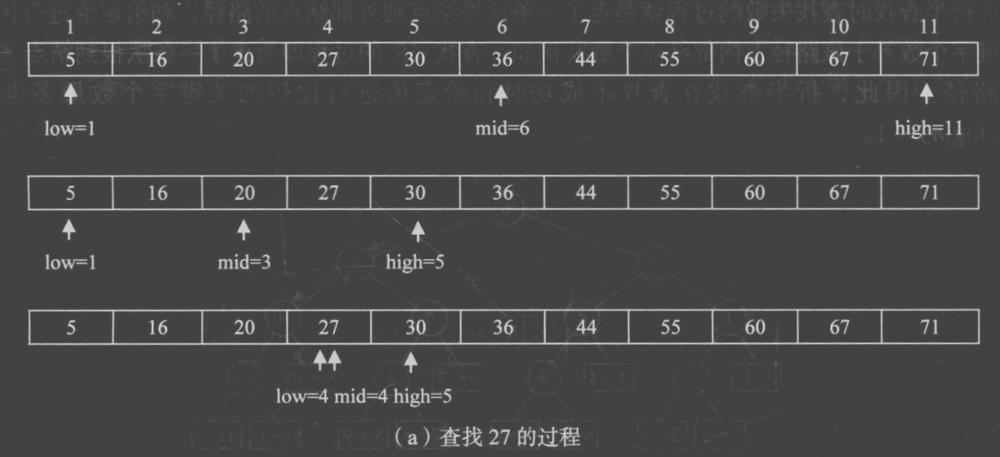

# 二分查找与分块查找

原 PDF 对应页：Algorithm.pdf 第 5-11 页。原文讲折半查找、判断树、分块查找和索引表。Python 版最重要的是把二分的区间含义写清楚。



## 一句话抓本质

二分查找每次排除一半答案；分块查找先用索引定位块，再在块内顺序查找。

## 标准二分：闭区间 [left, right]

```python
def binary_search(nums: list[int], target: int) -> int:
    left, right = 0, len(nums) - 1
    while left <= right:
        mid = (left + right) // 2
        if nums[mid] == target:
            return mid
        if nums[mid] < target:
            left = mid + 1
        else:
            right = mid - 1
    return -1

print(binary_search([1, 3, 5, 7, 9], 7))
```

变量角色：

| 变量 | 角色 | 边界含义 |
|---|---|---|
| left | 当前搜索区间左端 | 可能包含答案 |
| right | 当前搜索区间右端 | 可能包含答案 |
| mid | 中间位置 | 用来排除一半 |

## 手推

nums = [1, 3, 5, 7, 9]，target = 7。

| 轮次 | left | right | mid | nums[mid] | 动作 |
|---:|---:|---:|---:|---:|---|
| 1 | 0 | 4 | 2 | 5 | target 更大，left = 3 |
| 2 | 3 | 4 | 3 | 7 | 找到 |

循环条件为什么是 left <= right？因为闭区间里 left == right 时还有一个元素没检查。

## lower_bound：找第一个 >= target 的位置

很多题不是问“有没有”，而是问“第一个满足条件的位置”。

```python
def lower_bound(nums: list[int], target: int) -> int:
    left, right = 0, len(nums)
    while left < right:
        mid = (left + right) // 2
        if nums[mid] < target:
            left = mid + 1
        else:
            right = mid
    return left

print(lower_bound([1, 3, 3, 3, 8], 3))
print(lower_bound([1, 3, 3, 3, 8], 4))
```

这里用的是半开区间 [left, right)，循环条件是 left < right。

## 分块查找

分块查找适合：整体不是完全有序，但分成若干块，每块有最大值索引。

```python
def block_search(blocks: list[list[int]], target: int) -> tuple[int, int] | None:
    max_values = [max(block) for block in blocks]
    block_index = lower_bound(max_values, target)
    if block_index == len(blocks):
        return None
    for i, value in enumerate(blocks[block_index]):
        if value == target:
            return block_index, i
    return None

def lower_bound(nums: list[int], target: int) -> int:
    left, right = 0, len(nums)
    while left < right:
        mid = (left + right) // 2
        if nums[mid] < target:
            left = mid + 1
        else:
            right = mid
    return left

print(block_search([[8, 12], [20, 22], [33, 42]], 22))
```

## C 写法到 Python 写法

| C 语言笔记 | Python 写法 | 本质 |
|---|---|---|
| low / high | left / right | 区间边界 |
| mid = (low + high) / 2 | // 整除 | 下标必须是整数 |
| index table | max_values 或块元信息 | 先定位块 |
| 找不到返回 0 | 返回 -1 或 None | 避免和合法下标冲突 |

## 常见错法

错误 1：闭区间代码写 while left < right，漏掉最后一个元素。

错误 2：找到 target 后直接返回，但题目要第一个位置。重复元素题要用 lower_bound。

错误 3：mid 后边界不收缩，例如 right = mid + 1，会死循环或跳错方向。

## 题目信号

- 排好序的数组。
- 答案具有单调性：越往右越大，或某条件从 False 变 True。
- “最小的最大值”“最大的最小值”这类答案二分。

## 验收练习

1. 写 upper_bound：第一个 > target 的位置。
2. 用二分找 x 的整数平方根。
3. 解释闭区间和半开区间的循环条件为什么不同。
