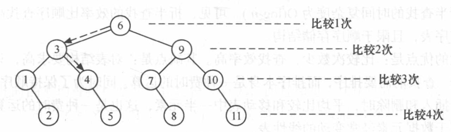

# 2. 折半查找与分块查找

**原 PDF 页码：** Algorithm.pdf P5-P11

## 2.1 原 PDF 小节

- 折半查找 Binary Search
- 算法分析：判断树
- 折半查找特点
- 分块查找 Blocking Search
- 索引表、块内顺序查找
- 线性表查找方法比较

## 2.2 折半查找前提

折半查找要求集合中的元素按关键字有序。

每次比较中间元素：

$$
mid=\left\lfloor \frac{low+high}{2}\right\rfloor
$$

若 key 小于中间元素，则：

$$
high=mid-1
$$

若 key 大于中间元素，则：

$$
low=mid+1
$$

## 2.3 原 PDF 图示




## 2.4 Python 复现：闭区间

```python
def binary_search(data: list[int], key: int) -> int:
    low = 0
    high = len(data) - 1
    while low <= high:
        mid = (low + high) // 2
        if data[mid] == key:
            return mid
        if data[mid] < key:
            low = mid + 1
        else:
            high = mid - 1
    return -1
```

闭区间写法的循环条件是：

$$
low\le high
$$

当查找失败时，最终出现：

$$
low>high
$$

## 2.5 判断树与复杂度

二分查找的比较过程可以画成判断树。若有 n 个元素，树高约为：

$$
h=\lfloor \log_2 n\rfloor+1
$$

所以查找复杂度为：

$$
T(n)=O(\log n)
$$

## 2.6 lower_bound 形式

很多 Python 题不是问有没有，而是问第一个大于等于 key 的位置。

```python
def lower_bound(data: list[int], key: int) -> int:
    low = 0
    high = len(data)
    while low < high:
        mid = (low + high) // 2
        if data[mid] < key:
            low = mid + 1
        else:
            high = mid
    return low
```

## 2.7 分块查找

分块查找把表分成若干块：块间有序，块内可以无序。先查索引表，再在块内顺序查找。

若共有 b 块，每块 s 个元素，则：

$$
n=b\times s
$$

索引表查找代价加块内查找代价：

$$
ASL_{block}=ASL_{index}+ASL_{inner}
$$

若索引用顺序查找，块内也顺序查找，粗略估计：

$$
ASL_{block}\approx \frac{b+1}{2}+\frac{s+1}{2}
$$

当 b 和 s 接近时，通常取：

$$
s\approx \sqrt n
$$

Python 复现：

```python
def block_search(blocks: list[list[int]], key: int) -> tuple[int, int] | None:
    index = [max(block) for block in blocks]
    block_id = lower_bound(index, key)
    if block_id == len(blocks):
        return None
    for i, value in enumerate(blocks[block_id]):
        if value == key:
            return block_id, i
    return None
```

## 2.8 特点比较

| 方法 | 前提 | 优点 | 缺点 |
|---|---|---|---|
| 顺序查找 | 无要求 | 简单 | ASL 大 |
| 折半查找 | 有序表 | O(log n) | 插入删除后维护有序麻烦 |
| 分块查找 | 块间有序 | 插入删除比全局有序容易 | 需要索引表 |
