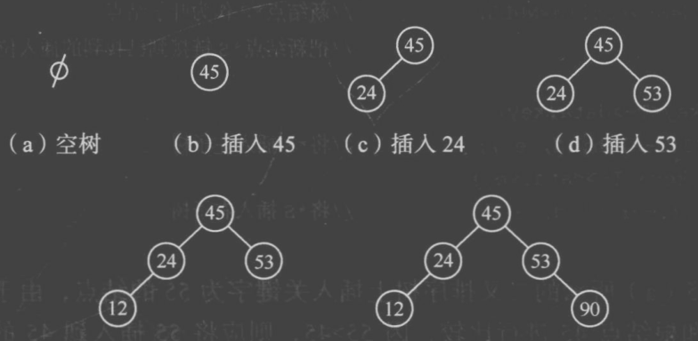

# BST 二叉搜索树

原 PDF 对应页：Algorithm.pdf 第 12-17 页。原文讲二叉排序树的查找、插入、创建和删除。Python 版先掌握性质：左小右大，中序有序。



## 一句话抓本质

BST 把“有序数组的二分思想”放进树里：每到一个节点，只需要决定去左子树还是右子树。

## 节点定义

```python
from dataclasses import dataclass

@dataclass
class BSTNode:
    key: int
    left: "BSTNode | None" = None
    right: "BSTNode | None" = None
```

## 查找

```python
from dataclasses import dataclass

@dataclass
class BSTNode:
    key: int
    left: "BSTNode | None" = None
    right: "BSTNode | None" = None

def search(root: BSTNode | None, key: int) -> BSTNode | None:
    cur = root
    while cur is not None:
        if key == cur.key:
            return cur
        if key < cur.key:
            cur = cur.left
        else:
            cur = cur.right
    return None
```

变量角色：

| 变量 | 角色 |
|---|---|
| cur | 当前比较的节点 |
| key | 要找的值 |
| cur.left | 更小的一边 |
| cur.right | 更大的一边 |

## 插入

```python
from dataclasses import dataclass

@dataclass
class BSTNode:
    key: int
    left: "BSTNode | None" = None
    right: "BSTNode | None" = None

def insert(root: BSTNode | None, key: int) -> BSTNode:
    if root is None:
        return BSTNode(key)
    if key < root.key:
        root.left = insert(root.left, key)
    elif key > root.key:
        root.right = insert(root.right, key)
    return root
```

这里默认不插入重复值。如果题目允许重复，要约定重复放左边还是右边，不能一会儿左一会儿右。

## 中序遍历得到有序序列

```python
from dataclasses import dataclass

@dataclass
class BSTNode:
    key: int
    left: "BSTNode | None" = None
    right: "BSTNode | None" = None

def inorder(root: BSTNode | None) -> list[int]:
    if root is None:
        return []
    return inorder(root.left) + [root.key] + inorder(root.right)
```

## 删除节点

删除分三种情况：叶子、只有一个孩子、有两个孩子。

```python
from dataclasses import dataclass

@dataclass
class BSTNode:
    key: int
    left: "BSTNode | None" = None
    right: "BSTNode | None" = None

def delete(root: BSTNode | None, key: int) -> BSTNode | None:
    if root is None:
        return None
    if key < root.key:
        root.left = delete(root.left, key)
    elif key > root.key:
        root.right = delete(root.right, key)
    else:
        if root.left is None:
            return root.right
        if root.right is None:
            return root.left
        successor = root.right
        while successor.left is not None:
            successor = successor.left
        root.key = successor.key
        root.right = delete(root.right, successor.key)
    return root
```

两个孩子时，用右子树最小节点 successor 替换当前节点。也可以用左子树最大节点 predecessor。

## 手推删除

删除 50：

```text
      50
     /  \
   30    70
        /  \
      60    80
```

右子树最小值是 60。把 50 改成 60，再去右子树删除原来的 60。

## 常见错法

错误 1：只改 root.key，不删除 successor 原节点，导致重复值。

错误 2：认为 BST 一定很快。极端插入顺序 1,2,3,4 会退化成链表，查找 O(n)。

错误 3：中序有序写成先序。BST 的有序性体现在中序遍历。

## 题目信号

- 动态维护有序集合。
- 查找、插入、删除都出现。
- 求第 k 小、范围内节点。
- 题目给 TreeNode 且满足左小右大。

## 验收练习

1. 插入 45, 24, 53, 12, 90，画出 BST。
2. 删除有两个孩子的根节点，并写出中序序列。
3. 解释为什么同一组数不同插入顺序会得到不同树形。
