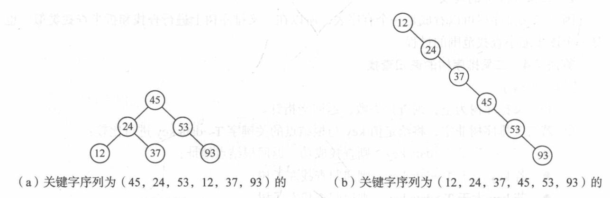

# 3. 二叉排序树（BST）

**原 PDF 页码：** Algorithm.pdf P12-P17

## 3.1 原 PDF 小节

- 二叉排序树数据类型定义
- 复习：递归创建二叉树
- BST 查找
- BST 插入
- 创建 BST
- BST 删除

## 3.2 BST 定义

二叉排序树满足：

$$
key(left) < key(root) < key(right)
$$

更准确地说：左子树所有关键字都小于根，右子树所有关键字都大于根，并且左右子树也都是 BST。

## 3.3 原 PDF 图示




## 3.4 Python 节点定义

```python
from dataclasses import dataclass

@dataclass
class BSTNode:
    key: int
    left: "BSTNode | None" = None
    right: "BSTNode | None" = None
```

## 3.5 BST 查找

```python
def bst_search(root: BSTNode | None, key: int) -> BSTNode | None:
    p = root
    while p is not None:
        if key == p.key:
            return p
        if key < p.key:
            p = p.left
        else:
            p = p.right
    return None
```

查找次数等于从根到目标节点的路径长度。若树高为 h：

$$
T=O(h)
$$

平衡时：

$$
h\approx \log_2 n
$$

退化成链表时：

$$
h=n
$$

## 3.6 插入与创建

```python
def bst_insert(root: BSTNode | None, key: int) -> BSTNode:
    if root is None:
        return BSTNode(key)
    if key < root.key:
        root.left = bst_insert(root.left, key)
    elif key > root.key:
        root.right = bst_insert(root.right, key)
    return root

def build_bst(values: list[int]) -> BSTNode | None:
    root = None
    for value in values:
        root = bst_insert(root, value)
    return root
```

## 3.7 中序遍历

BST 的中序遍历是递增序列：

$$
InOrder(BST)=sorted(keys)
$$

```python
def inorder(root: BSTNode | None) -> list[int]:
    if root is None:
        return []
    return inorder(root.left) + [root.key] + inorder(root.right)
```

## 3.8 删除

删除分三种情况：

| 情况 | 处理 |
|---|---|
| 叶子节点 | 直接删除 |
| 只有一个子树 | 用子树顶上来 |
| 有两个子树 | 用直接前驱或直接后继替换 |

Python 用右子树最小节点作为后继：

```python
def bst_delete(root: BSTNode | None, key: int) -> BSTNode | None:
    if root is None:
        return None
    if key < root.key:
        root.left = bst_delete(root.left, key)
    elif key > root.key:
        root.right = bst_delete(root.right, key)
    else:
        if root.left is None:
            return root.right
        if root.right is None:
            return root.left
        successor = root.right
        while successor.left is not None:
            successor = successor.left
        root.key = successor.key
        root.right = bst_delete(root.right, successor.key)
    return root
```
