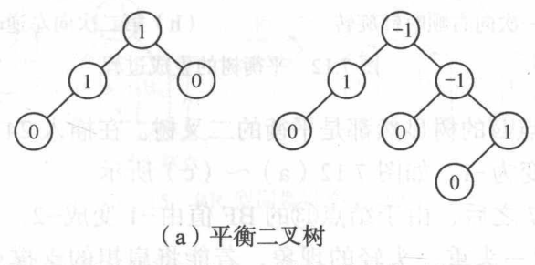
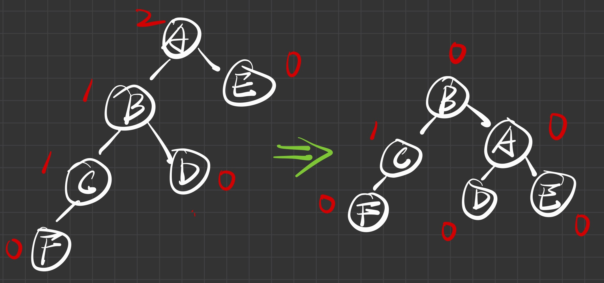
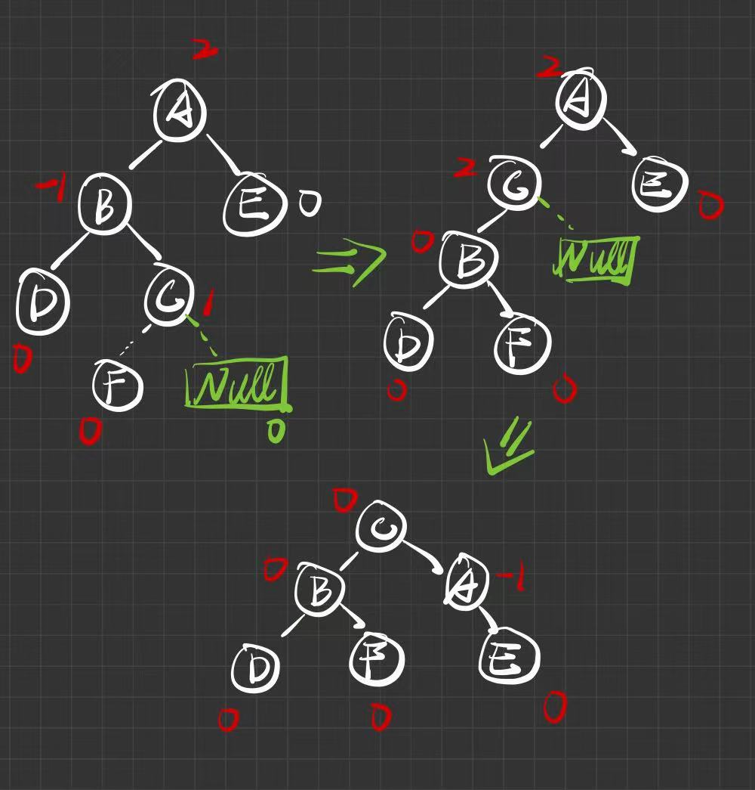

# 4. AVL 树：平衡因子与旋转

**原 PDF 页码：** Algorithm.pdf P18-P28

## 4.1 原 PDF 小节

- AVL 树定义
- LL 型旋转（右旋）
- RR 型旋转（左旋）
- LR 型旋转（左右旋）
- RL 型旋转（右左旋）
- 左平衡、右平衡
- 插入节点并及时平衡

## 4.2 平衡因子

原 PDF 中平衡因子定义为：

$$
BF(T)=h(T_l)-h(T_r)
$$

AVL 树要求每个节点满足：

$$
BF(T)\in\{-1,0,1\}
$$

## 4.3 原 PDF 图示







## 4.4 Python 节点定义

```python
from dataclasses import dataclass

@dataclass
class AVLNode:
    key: int
    left: "AVLNode | None" = None
    right: "AVLNode | None" = None
    height: int = 1

def height(node: AVLNode | None) -> int:
    return node.height if node else 0

def update(node: AVLNode) -> None:
    node.height = 1 + max(height(node.left), height(node.right))

def balance_factor(node: AVLNode | None) -> int:
    return height(node.left) - height(node.right) if node else 0
```

## 4.5 右旋与左旋

右旋保持中序序列不变：

$$
T_1 < x < T_2 < y < T_3
$$

旋转前后这个顺序不变，只改变高度。

```python
def rotate_right(y: AVLNode) -> AVLNode:
    x = y.left
    assert x is not None
    t2 = x.right
    x.right = y
    y.left = t2
    update(y)
    update(x)
    return x

def rotate_left(x: AVLNode) -> AVLNode:
    y = x.right
    assert y is not None
    t2 = y.left
    y.left = x
    x.right = t2
    update(x)
    update(y)
    return y
```

## 4.6 四种失衡类型

| 类型 | 插入位置 | 修正 |
|---|---|---|
| LL | 左孩子的左子树 | 右旋 |
| RR | 右孩子的右子树 | 左旋 |
| LR | 左孩子的右子树 | 左旋左孩子，再右旋 |
| RL | 右孩子的左子树 | 右旋右孩子，再左旋 |

## 4.7 插入并平衡

```python
def avl_insert(root: AVLNode | None, key: int) -> AVLNode:
    if root is None:
        return AVLNode(key)
    if key < root.key:
        root.left = avl_insert(root.left, key)
    elif key > root.key:
        root.right = avl_insert(root.right, key)
    else:
        return root

    update(root)
    bf = balance_factor(root)

    if bf > 1 and root.left is not None and key < root.left.key:
        return rotate_right(root)
    if bf < -1 and root.right is not None and key > root.right.key:
        return rotate_left(root)
    if bf > 1 and root.left is not None and key > root.left.key:
        root.left = rotate_left(root.left)
        return rotate_right(root)
    if bf < -1 and root.right is not None and key < root.right.key:
        root.right = rotate_right(root.right)
        return rotate_left(root)
    return root
```

## 4.8 复杂度

AVL 通过旋转维持高度：

$$
h=O(\log n)
$$

因此查找、插入、删除都保持：

$$
T=O(\log n)
$$
