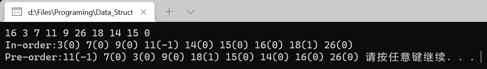

# 哈希表与冲突处理

原 PDF 对应页：Algorithm.pdf 第 29-34 页。原文讲 hash 函数、冲突处理、除留余数法和查找效率。Python 版对应最常用的 dict 和 set。



## 一句话抓本质

哈希表用一个函数把 key 映射到存储位置，理想情况下查找、插入、删除接近 O(1)。

## Python dict

```python
count: dict[str, int] = {}
for ch in "banana":
    count[ch] = count.get(ch, 0) + 1
print(count)
```

变量角色：

| 变量 | 角色 |
|---|---|
| key | 查找依据，比如字符 ch |
| value | key 对应的信息，比如次数 |
| hash(key) | Python 内部用于定位桶 |
| count.get(ch, 0) | 没出现过时给默认值 |

## set 用来判重

```python
def has_duplicate(nums: list[int]) -> bool:
    seen: set[int] = set()
    for x in nums:
        if x in seen:
            return True
        seen.add(x)
    return False
```

## 冲突是什么

不同 key 可能映射到同一个位置，这就是冲突。原 PDF 提到除留余数法：index = key % m。比如 m = 7：

| key | key % 7 |
|---:|---:|
| 10 | 3 |
| 17 | 3 |
| 24 | 3 |

10、17、24 都落在 3 号位置，发生冲突。

Python dict 内部已经处理冲突，你刷题时通常不需要手写开放定址或链地址法，但要知道：哈希表不是“没有代价”，只是平均很快。

## 手写简单链地址法

```python
class SimpleHashMap:
    def __init__(self, capacity: int = 8):
        self.buckets: list[list[tuple[int, int]]] = [[] for _ in range(capacity)]

    def _index(self, key: int) -> int:
        return key % len(self.buckets)

    def put(self, key: int, value: int) -> None:
        bucket = self.buckets[self._index(key)]
        for i, (k, _) in enumerate(bucket):
            if k == key:
                bucket[i] = (key, value)
                return
        bucket.append((key, value))

    def get(self, key: int) -> int | None:
        bucket = self.buckets[self._index(key)]
        for k, v in bucket:
            if k == key:
                return v
        return None
```

## 常见刷题模板

频次统计：

```python
def frequency(nums: list[int]) -> dict[int, int]:
    freq: dict[int, int] = {}
    for x in nums:
        freq[x] = freq.get(x, 0) + 1
    return freq
```

两数之和：

```python
def two_sum(nums: list[int], target: int) -> tuple[int, int] | None:
    pos: dict[int, int] = {}
    for i, x in enumerate(nums):
        need = target - x
        if need in pos:
            return pos[need], i
        pos[x] = i
    return None
```

## C 写法到 Python 写法

| C 语言笔记 | Python 写法 | 本质 |
|---|---|---|
| hash 函数 | hash(key) 或自定义取模 | key 到位置 |
| 链地址法 | bucket 里放列表 | 冲突后继续存 |
| 查找成功/失败 ASL | 平均复杂度 | 冲突越多越慢 |
| Hash Table | dict / set | 标准库已经实现 |

## 常见错法

错误 1：边遍历边只存当前值，忘记先查 complement。两数之和必须先问“之前有没有需要的数”。

错误 2：用 list 判断是否出现过，导致 O(n²)。判重要用 set。

错误 3：key 不可哈希。list 不能作为 dict key，可以转成 tuple。

## 题目信号

- 出现次数、频率。
- 是否存在、是否重复。
- 两数和、配对。
- 需要 O(1) 查询历史信息。

## 验收练习

1. 写函数找数组中第一个只出现一次的数字。
2. 写函数判断两个字符串是否是异位词。
3. 解释为什么 list 不能作为 dict 的 key。
