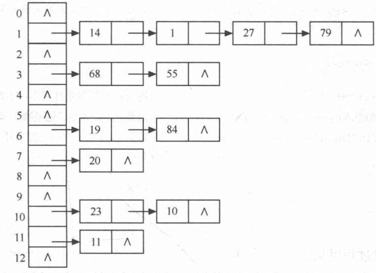

# 6. 排序总览：稳定性与复杂度

**原 PDF 页码：** Algorithm.pdf P35-P52

## 6.1 原 PDF 排序目录

- 直接插入排序
- 折半插入排序
- 希尔排序
- 冒泡排序
- 快速排序
- 选择排序
- 堆排序
- 归并排序
- 基数排序
- 排序总结

## 6.2 排序稳定性

如果两个记录关键字相同，排序前后相对顺序不变，则排序算法稳定。

例：

$$
(90,A),(80,B),(90,C)
$$

按分数排序后，若 A 仍在 C 前面，则稳定。

Python 内置 sorted 是稳定排序。

```python
students = [(90, "A"), (80, "B"), (90, "C")]
print(sorted(students, key=lambda x: x[0]))
```

## 6.3 原 PDF 图示



## 6.4 总复杂度表

| 排序 | 平均时间 | 最坏时间 | 空间 | 稳定性 |
|---|---:|---:|---:|---|
| 直接插入 | O(n^2) | O(n^2) | O(1) | 稳定 |
| 折半插入 | O(n^2) | O(n^2) | O(1) | 稳定 |
| 希尔 | 与 gap 有关 | 与 gap 有关 | O(1) | 不稳定 |
| 冒泡 | O(n^2) | O(n^2) | O(1) | 稳定 |
| 快速排序 | O(n log n) | O(n^2) | O(log n) | 不稳定 |
| 简单选择 | O(n^2) | O(n^2) | O(1) | 不稳定 |
| 堆排序 | O(n log n) | O(n log n) | O(1) | 不稳定 |
| 归并排序 | O(n log n) | O(n log n) | O(n) | 稳定 |
| 基数排序 | O(d(n+r)) | O(d(n+r)) | O(n+r) | 稳定 |

## 6.5 比较排序下界

基于比较的排序，在最坏情况下比较次数下界为：

$$
\Omega(n\log n)
$$

基数排序不是比较排序，所以它的复杂度写成与位数 d、基数 r 有关：

$$
T=O(d(n+r))
$$

## 6.6 Python 排序接口

```python
items = [("apple", 3), ("banana", 2), ("pear", 3)]
print(sorted(items, key=lambda x: x[1]))
print(sorted(items, key=lambda x: (x[1], x[0])))
```

实际刷题中：需要排序结果时优先使用 sorted；需要理解算法时再手写。
