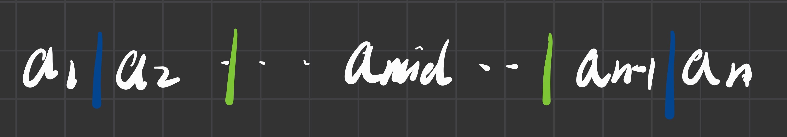

# 7. 插入、希尔、选择、冒泡排序

**原 PDF 页码：** Algorithm.pdf P35-P39, P43-P45

## 7.1 直接插入排序

核心：把当前元素插入到前面已经有序的序列中。

第 i 轮循环前：

$$
R[0:i] \text{ 已经有序}
$$

```python
def insertion_sort(nums: list[int]) -> list[int]:
    arr = nums[:]
    for i in range(1, len(arr)):
        key = arr[i]
        j = i - 1
        while j >= 0 and arr[j] > key:
            arr[j + 1] = arr[j]
            j -= 1
        arr[j + 1] = key
    return arr
```

最好情况已经有序：

$$
T_{best}=O(n)
$$

最坏情况逆序：

$$
T_{worst}=O(n^2)
$$

## 7.2 折半插入排序

折半插入用二分查找插入位置，但元素移动仍然存在：

$$
T(n)=O(n^2)
$$

## 7.3 希尔排序

希尔排序按 gap 分组进行插入排序。

```python
def shell_sort(nums: list[int]) -> list[int]:
    arr = nums[:]
    gap = len(arr) // 2
    while gap > 0:
        for i in range(gap, len(arr)):
            key = arr[i]
            j = i - gap
            while j >= 0 and arr[j] > key:
                arr[j + gap] = arr[j]
                j -= gap
            arr[j + gap] = key
        gap //= 2
    return arr
```

## 7.4 冒泡排序

每轮把当前未排序区间中的最大元素交换到末尾。

```python
def bubble_sort(nums: list[int]) -> list[int]:
    arr = nums[:]
    for end in range(len(arr) - 1, 0, -1):
        swapped = False
        for i in range(end):
            if arr[i] > arr[i + 1]:
                arr[i], arr[i + 1] = arr[i + 1], arr[i]
                swapped = True
        if not swapped:
            break
    return arr
```

若加 swapped 标记，已经有序时：

$$
T_{best}=O(n)
$$

## 7.5 简单选择排序

每轮从未排序区间中选择最小元素，放到前面。

```python
def selection_sort(nums: list[int]) -> list[int]:
    arr = nums[:]
    for i in range(len(arr) - 1):
        min_index = i
        for j in range(i + 1, len(arr)):
            if arr[j] < arr[min_index]:
                min_index = j
        arr[i], arr[min_index] = arr[min_index], arr[i]
    return arr
```

比较次数固定约为：

$$
\frac{n(n-1)}{2}
$$

## 7.6 图示



