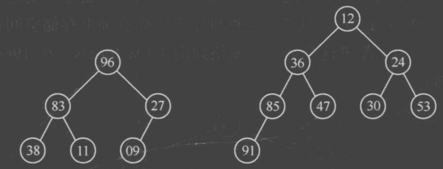

# 插入、希尔、选择、冒泡排序

原 PDF 对应页：Algorithm.pdf 第 35-39、43-45 页。这几类都是基础排序，速度不一定最好，但非常适合训练循环边界和不变量。



## 一句话抓本质

插入排序维护左边有序；选择排序每轮选最小；冒泡排序把大元素一路交换到后面；希尔排序让元素先大步接近正确位置。

## 直接插入排序

```python
def insertion_sort(nums: list[int]) -> list[int]:
    arr = nums[:]
    for i in range(1, len(arr)):
        key = arr[i]
        j = i - 1
        while j >= 0 and arr[j] > key:
            arr[j + 1] = arr[j]
            j -= 1
        arr[j + 1] = key
    return arr

print(insertion_sort([5, 2, 4, 1]))
```

手推第一轮：

| i | key | j 比较 | arr |
|---:|---:|---|---|
| 1 | 2 | 5 > 2，5 右移 | [5, 5, 4, 1] |
| 1 | 2 | j 到 -1，放 2 | [2, 5, 4, 1] |

循环不变量：每轮开始时，arr[0:i] 已经有序。

## 希尔排序

```python
def shell_sort(nums: list[int]) -> list[int]:
    arr = nums[:]
    gap = len(arr) // 2
    while gap > 0:
        for i in range(gap, len(arr)):
            key = arr[i]
            j = i - gap
            while j >= 0 and arr[j] > key:
                arr[j + gap] = arr[j]
                j -= gap
            arr[j + gap] = key
        gap //= 2
    return arr
```

希尔排序可以理解为“分组插入排序”。gap 大时先粗调，gap 变成 1 时就是普通插入排序，但数组已经接近有序。

## 选择排序

```python
def selection_sort(nums: list[int]) -> list[int]:
    arr = nums[:]
    n = len(arr)
    for i in range(n - 1):
        min_idx = i
        for j in range(i + 1, n):
            if arr[j] < arr[min_idx]:
                min_idx = j
        arr[i], arr[min_idx] = arr[min_idx], arr[i]
    return arr
```

选择排序每轮只保证一个位置：第 i 轮把最小值放到 i。

## 冒泡排序

```python
def bubble_sort(nums: list[int]) -> list[int]:
    arr = nums[:]
    n = len(arr)
    for end in range(n - 1, 0, -1):
        swapped = False
        for i in range(end):
            if arr[i] > arr[i + 1]:
                arr[i], arr[i + 1] = arr[i + 1], arr[i]
                swapped = True
        if not swapped:
            break
    return arr
```

如果一轮没有发生交换，说明已经有序，可以提前结束。

## 四种排序对比

| 算法 | 每轮做什么 | 稳定性 | 近似有序表现 |
|---|---|---|---|
| 插入 | 把当前数插入左边有序区 | 稳定 | 好 |
| 希尔 | 按 gap 做插入 | 不稳定 | 较好 |
| 选择 | 找最小放前面 | 不稳定 | 不变 |
| 冒泡 | 相邻逆序就交换 | 稳定 | 可提前结束 |

## 常见错法

错误 1：插入排序最后写 arr[j] = key。循环结束时 j 已经退到 key 应该放的位置前面，所以要写 arr[j + 1] = key。

错误 2：冒泡内层范围写到 n - 1，每轮都重复比较已确定的尾部。

错误 3：选择排序以为稳定。交换最小值可能跨过相等元素。

## 题目信号

基础排序本身不是高频最优解，但它们能训练：

- 双层循环边界。
- 原地修改数组。
- 稳定性判断。
- 近似有序数据的优化。

## 验收练习

1. 手推 insertion_sort([4, 3, 2]) 的每次移动。
2. 写一个稳定版本的选择排序。
3. 解释冒泡排序为什么可以提前结束。
