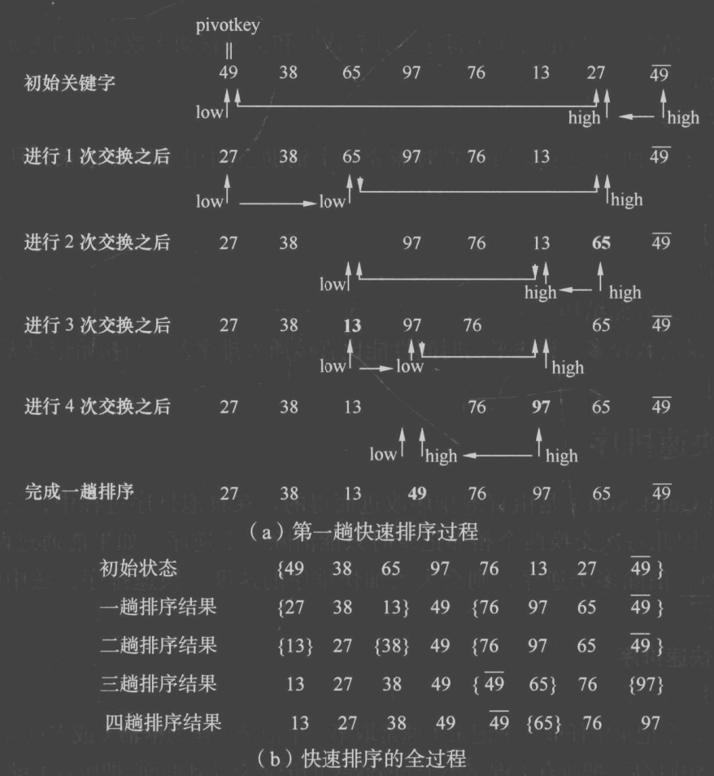
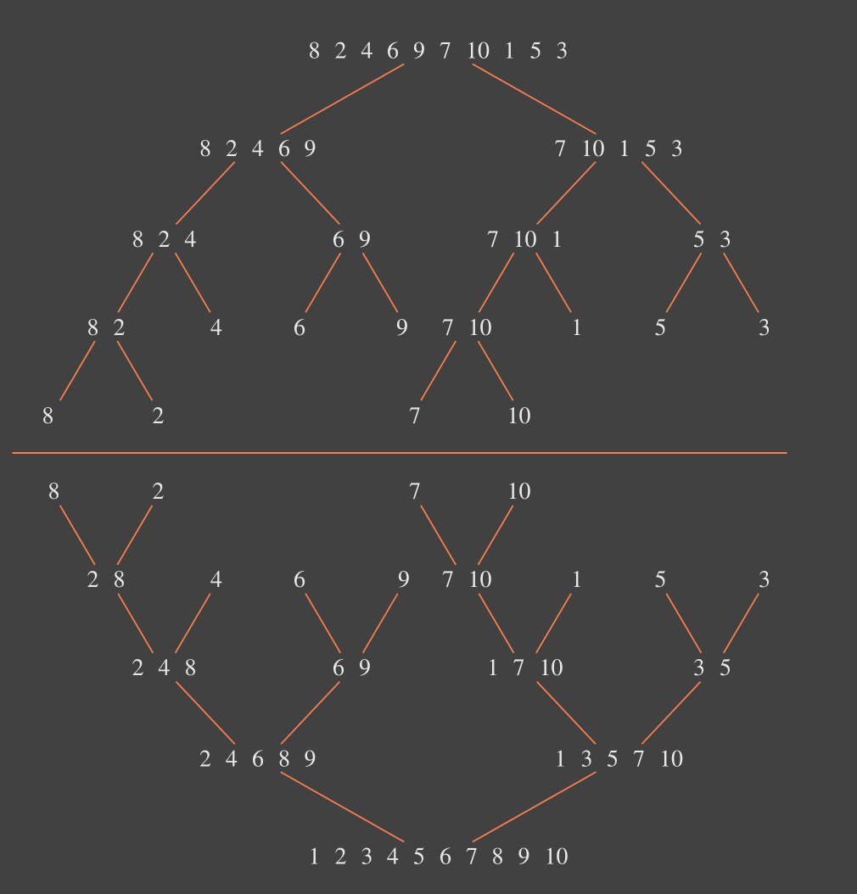
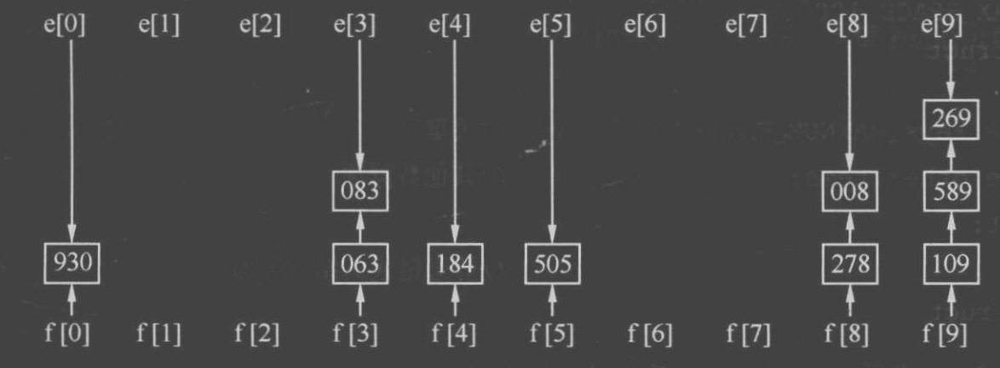

# 8. 快排、归并、堆排序、基数排序

**原 PDF 页码：** Algorithm.pdf P39-P52

## 8.1 快速排序

快速排序用 pivot 把序列分成两部分：

$$
left \le pivot \le right
$$

递归式：

$$
T(n)=T(k)+T(n-k-1)+O(n)
$$

平均：

$$
T_{avg}=O(n\log n)
$$

最坏：

$$
T_{worst}=O(n^2)
$$



```python
def quick_sort(nums: list[int]) -> list[int]:
    arr = nums[:]

    def partition(left: int, right: int) -> int:
        pivot = arr[right]
        store = left
        for i in range(left, right):
            if arr[i] <= pivot:
                arr[store], arr[i] = arr[i], arr[store]
                store += 1
        arr[store], arr[right] = arr[right], arr[store]
        return store

    def sort(left: int, right: int) -> None:
        if left >= right:
            return
        mid = partition(left, right)
        sort(left, mid - 1)
        sort(mid + 1, right)

    sort(0, len(arr) - 1)
    return arr
```

## 8.2 归并排序

归并排序先分割，再合并两个有序序列。

递归式：

$$
T(n)=2T\left(\frac{n}{2}\right)+O(n)=O(n\log n)
$$

空间复杂度：

$$
S(n)=O(n)
$$



```python
def merge_sort(nums: list[int]) -> list[int]:
    if len(nums) <= 1:
        return nums[:]
    mid = len(nums) // 2
    left = merge_sort(nums[:mid])
    right = merge_sort(nums[mid:])
    return merge(left, right)

def merge(left: list[int], right: list[int]) -> list[int]:
    i = 0
    j = 0
    ans: list[int] = []
    while i < len(left) and j < len(right):
        if left[i] <= right[j]:
            ans.append(left[i])
            i += 1
        else:
            ans.append(right[j])
            j += 1
    ans.extend(left[i:])
    ans.extend(right[j:])
    return ans
```

## 8.3 堆排序

堆满足父节点不小于或不大于孩子节点。数组下标关系（0 下标）：

$$
parent(i)=\left\lfloor\frac{i-1}{2}\right\rfloor
$$

$$
left(i)=2i+1,\quad right(i)=2i+2
$$

建堆复杂度：

$$
O(n)
$$

堆排序复杂度：

$$
O(n\log n)
$$

Python 常用 heapq 处理堆题：

```python
from heapq import heappop, heappush

def top_k_smallest(nums: list[int], k: int) -> list[int]:
    heap: list[int] = []
    for x in nums:
        heappush(heap, x)
    return [heappop(heap) for _ in range(min(k, len(heap)))]
```

## 8.4 基数排序

基数排序按位分配、收集。若有 d 位、基数为 r：

$$
T=O(d(n+r))
$$



```python
def radix_sort(nums: list[int]) -> list[int]:
    if not nums:
        return []
    arr = nums[:]
    exp = 1
    max_value = max(arr)
    while max_value // exp > 0:
        buckets = [[] for _ in range(10)]
        for x in arr:
            digit = (x // exp) % 10
            buckets[digit].append(x)
        arr = [x for bucket in buckets for x in bucket]
        exp *= 10
    return arr
```

## 8.5 原 PDF 排序总结

| 分类 | 算法 |
|---|---|
| 时间性能较好 | 快速排序、归并排序、堆排序 |
| 简单排序 | 直接插入、冒泡、简单选择 |
| 空间开销大 | 归并排序、基数排序 |
| 不稳定 | 快速排序、堆排序、简单选择、希尔排序 |
