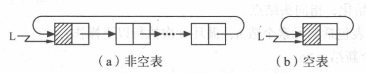

# 1. 线性表（Linear List）

**原 PDF 页码：** DataStructure.pdf P5-P18

## 1.1 原 PDF 小节

- 宏定义 define.h
- 顺序表 Sequence List：初始化、获取元素、查找元素、插入、删除、销毁、清空、判空
- 单链表 Single Linked List：头插法、尾插法、获取、查找、插入、删除
- 循环链表 Circular Linked List
- 双向链表 Double Linked List
- 线性表玩具：线性表合并、有序表合并、多项式创建与相加

## 1.2 顺序表定义

线性表是由 n 个数据元素组成的有限序列：

$$
L=(a_1,a_2,\cdots,a_n)
$$

顺序表要求逻辑上相邻的元素，物理存储位置也相邻。原 PDF 中顺序表的地址公式是：

$$
LOC(a_i)=LOC(a_1)+(i-1)\times l
$$

其中 l 表示每个元素占用的存储单元长度。Python 中的 list 可以看作顺序表的常用实现。

```python
a = [12, 25, 37, 49]
print(a[2])       # 获取第 3 个逻辑元素：37
print(a.index(25))
a.insert(2, 30)   # 在下标 2 插入
print(a)
a.pop(1)          # 删除下标 1
print(a)
```

## 1.3 顺序表查找与 ASL

如果从头到尾查找，第 i 个元素被找到需要比较 i 次。平均查找长度：

$$
ASL=\sum_{i=1}^{n}P_iC_i
$$

若每个元素查找概率相等：

$$
P_i=\frac{1}{n},\quad C_i=i
$$

则：

$$
ASL=\frac{1}{n}\sum_{i=1}^{n}i=\frac{n+1}{2}
$$

Python 复现：

```python
def locate_elem(seq: list[int], target: int) -> int:
    for i, value in enumerate(seq):
        if value == target:
            return i
    return -1
```

## 1.4 顺序表插入与删除

顺序表在中间插入元素时，需要移动后面的元素。插入到第 i 个位置，平均移动次数约为：

$$
E_{insert}=\frac{n}{2}
$$

删除第 i 个位置，平均移动次数约为：

$$
E_{delete}=\frac{n-1}{2}
$$

Python list.insert() 和 list.pop(index) 已经封装了移动过程，但复杂度仍是 O(n)。

## 1.5 单链表

原 PDF 图示：


链表节点由“数据域 + 指针域”组成。C 中是 data 和 next，Python 中写成对象属性。

```python
from dataclasses import dataclass

@dataclass
class ListNode:
    data: int
    next: "ListNode | None" = None

def create_by_tail(values: list[int]) -> ListNode | None:
    head = ListNode(0)     # 头结点，不存真实数据
    tail = head
    for value in values:
        tail.next = ListNode(value)
        tail = tail.next
    return head.next

def to_list(head: ListNode | None) -> list[int]:
    ans = []
    p = head
    while p is not None:
        ans.append(p.data)
        p = p.next
    return ans
```

### 头插法与尾插法

| 建表方法 | 原 PDF 含义 | Python 现象 | 结果顺序 |
|---|---|---|---|
| 头插法 | 新节点插到头结点后面 | 每次让新节点指向旧头 | 与输入相反 |
| 尾插法 | 新节点接到尾节点后面 | 用 tail 维护尾部 | 与输入相同 |

头插法 Python 复现：

```python
from dataclasses import dataclass

@dataclass
class ListNode:
    data: int
    next: "ListNode | None" = None

def create_by_head(values: list[int]) -> ListNode | None:
    head = ListNode(0)
    for value in values:
        node = ListNode(value)
        node.next = head.next
        head.next = node
    return head.next
```

## 1.6 单链表插入删除

插入的核心不是“移动元素”，而是改指针：

$$
node.next=p.next,\quad p.next=node
$$

删除的核心是让前驱节点跳过当前节点：

$$
p.next=p.next.next
$$

```python
from dataclasses import dataclass

@dataclass
class ListNode:
    data: int
    next: "ListNode | None" = None

def insert_after(p: ListNode, value: int) -> None:
    node = ListNode(value)
    node.next = p.next
    p.next = node

def delete_after(p: ListNode) -> None:
    if p.next is not None:
        p.next = p.next.next
```

## 1.7 循环链表与双向链表

循环链表：最后一个节点的 next 指向头结点或第一个节点。

双向链表：每个节点同时保存前驱和后继。



```python
from dataclasses import dataclass

@dataclass
class DoubleNode:
    data: int
    prev: "DoubleNode | None" = None
    next: "DoubleNode | None" = None

def link(a: DoubleNode, b: DoubleNode) -> None:
    a.next = b
    b.prev = a
```

## 1.8 复杂度表

| 操作 | 顺序表 list | 单链表 |
|---|---:|---:|
| 按下标访问 | O(1) | O(n) |
| 查找值 | O(n) | O(n) |
| 已知位置插入 | O(n) | O(1) |
| 已知前驱删除 | O(n) | O(1) |
| 额外空间 | 少 | 每个节点多一个指针 |

## 1.9 Python 与原 C 代码的对应

| 原 PDF C 写法 | Python 复现 |
|---|---|
| Sqlist *L | list[int] 或封装类 |
| L->base[i] | a[i] |
| LinkList p | p: ListNode |
| p->next | p.next |
| malloc(sizeof(LNode)) | ListNode(value) |
