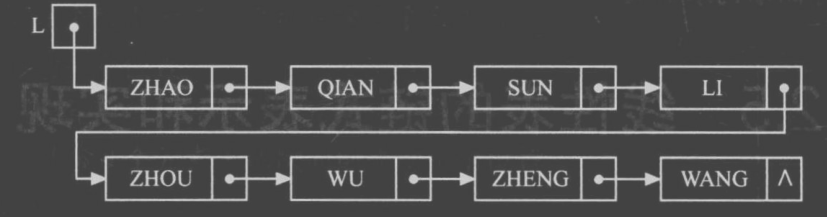

# 线性表：Python list 与链表节点

原 PDF 对应页：DataStructure.pdf 第 5-18 页。原文从顺序表、单链表、循环链表、双向链表讲起，C 语言重点是数组地址、结构体指针和 malloc。Python 版要抓住更核心的东西：线性表就是“一排元素”，区别只在于“能不能直接按下标跳过去”。



## 一句话抓本质

线性表关心的是元素之间的前后关系；Python list 适合随机访问，链表适合练“节点指向下一个节点”的思维。

## Python 里的顺序表

Python 的 list 可以直接当顺序表用：

```python
nums = [10, 20, 30, 40]
print(nums[2])       # 30，按下标访问
nums.insert(1, 15)   # [10, 15, 20, 30, 40]
nums.pop(3)          # 删除下标 3 的元素 30
print(nums)
```

变量角色：

| 变量 | 角色 | 常见错误 |
|---|---|---|
| nums | 顺序表本体 | 把它当成固定长度数组，忘了 Python 会自动扩容 |
| i | 下标 | 把第 i 个元素和下标 i 混在一起 |
| value | 要插入或查找的值 | 查值和查位置不是一回事 |

## 顺序表的插入为什么慢

在中间插入一个元素，后面的元素要整体右移。

例子：在下标 1 插入 15。

| 步骤 | list 状态 | 发生了什么 |
|---|---|---|
| 初始 | [10, 20, 30, 40] | 20 在下标 1 |
| 腾位置 | [10, _, 20, 30, 40] | 20、30、40 逻辑上后移 |
| 放入 | [10, 15, 20, 30, 40] | 15 放进下标 1 |

所以中间插入/删除是 O(n)，末尾 append 通常是 O(1)。

## 单链表节点

链表没有连续下标，每个节点只知道下一个节点是谁。

```python
from dataclasses import dataclass

@dataclass
class ListNode:
    val: int
    next: "ListNode | None" = None

def build_linked_list(values: list[int]) -> ListNode | None:
    dummy = ListNode(0)
    tail = dummy
    for x in values:
        tail.next = ListNode(x)
        tail = tail.next
    return dummy.next

def to_list(head: ListNode | None) -> list[int]:
    ans = []
    cur = head
    while cur is not None:
        ans.append(cur.val)
        cur = cur.next
    return ans

head = build_linked_list([10, 20, 30])
print(to_list(head))
```

这里 dummy 是虚拟头节点。它的作用不是存数据，而是让“插到头部”和“插到中间”统一成同一种写法。

## 链表插入

在第 index 个位置前插入 value。index 从 0 开始。

```python
from dataclasses import dataclass

@dataclass
class ListNode:
    val: int
    next: "ListNode | None" = None

def insert_at(head: ListNode | None, index: int, value: int) -> ListNode | None:
    if index < 0:
        raise IndexError("index must be non-negative")
    dummy = ListNode(0, head)
    prev = dummy
    for _ in range(index):
        if prev.next is None:
            raise IndexError("index out of range")
        prev = prev.next
    prev.next = ListNode(value, prev.next)
    return dummy.next
```

手推：head = 10 -> 20 -> 30，在 index = 1 插入 15。

| 步骤 | prev 指向 | prev.next 指向 | 动作 |
|---|---|---|---|
| 初始 | dummy | 10 | 准备走到插入点前一个节点 |
| 走 1 步 | 10 | 20 | prev 正好在 index 前面 |
| 改指针 | 10 | 15 | 新节点 next 指向原来的 20 |
| 结果 | 10 | 15 -> 20 -> 30 | 链接完成 |

## 链表删除

删除第 index 个节点。

```python
from dataclasses import dataclass

@dataclass
class ListNode:
    val: int
    next: "ListNode | None" = None

def delete_at(head: ListNode | None, index: int) -> ListNode | None:
    if index < 0:
        raise IndexError("index must be non-negative")
    dummy = ListNode(0, head)
    prev = dummy
    for _ in range(index):
        if prev.next is None:
            raise IndexError("index out of range")
        prev = prev.next
    if prev.next is None:
        raise IndexError("index out of range")
    prev.next = prev.next.next
    return dummy.next
```

## C 写法到 Python 写法

| C 语言笔记 | Python 写法 | 你要理解的本质 |
|---|---|---|
| malloc 一个节点 | ListNode(value) | 创建一个节点对象 |
| p->next | p.next | 找到下一个节点 |
| 头指针 L | head 变量 | 链表入口 |
| 头插法 | 新节点 next 指向原 head | 让新节点成为入口 |
| 尾插法 | tail 一直指向最后节点 | 省去每次从头找尾巴 |

## 常见错法

错误 1：删除时让 cur 跳走，而不是让前一个节点跳过目标。

```python
def wrong_delete(cur):
    cur = cur.next
    return cur
```

这只是改变了局部变量 cur，没有改变链表结构。真正要改的是 prev.next。

错误 2：不用 dummy，头节点删除要单独写很多分支。比赛里分支越多，越容易漏边界。

## 复杂度

| 操作 | Python list | 单链表 |
|---|---:|---:|
| 访问第 i 个 | O(1) | O(n) |
| 查找某个值 | O(n) | O(n) |
| 已知位置后插入 | O(n)，要搬元素 | O(1)，改指针 |
| 删除中间元素 | O(n)，要搬元素 | O(1)，改指针 |

注意：链表的 O(1) 插入删除成立的前提是“已经拿到前一个节点”。如果还要从头找，那整体仍然是 O(n)。

## 题目信号

看到这些词，优先想到链表思维：

- 删除倒数第 k 个节点。
- 反转链表。
- 合并两个有序链表。
- 判断链表是否有环。
- 题目给的是 ListNode，而不是数组。

## 验收练习

1. 用 dummy 写删除链表第一个值等于 target 的节点。
2. 手推 1 -> 2 -> 3 反转成 3 -> 2 -> 1，每一步写出 prev、cur、nxt。
3. 说清楚为什么 Python list 的 insert(0, x) 是 O(n)。
