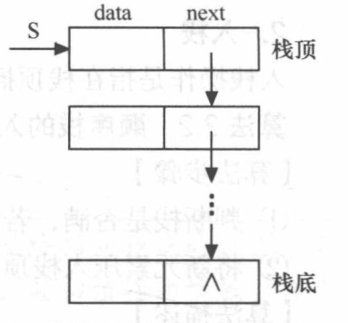
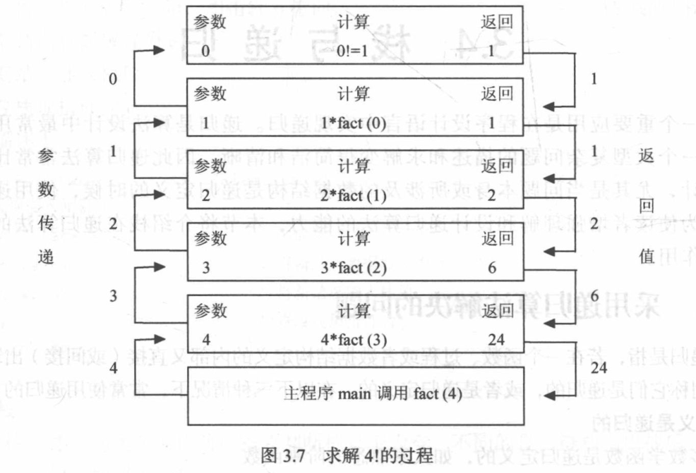

# 2. 栈和队列（Stack and Queue）

**原 PDF 页码：** DataStructure.pdf P19-P31

## 2.1 原 PDF 小节

- 顺序栈：类型定义、初始化、Push、Pop、取栈顶、判空
- 链栈：类型定义、初始化、Push、Pop
- 栈与递归：函数调用过程
- 循环队列：初始化、入队、出队、其他操作
- 链队：初始化、入队、出队
- 玩具例题：进制转换、括号匹配、10 以内计算器

## 2.2 栈的定义

栈是只允许在一端插入和删除的线性表。

$$
LIFO = Last\ In\ First\ Out
$$

Python 用 list 的末尾作为栈顶：

```python
stack: list[str] = []
stack.append("E")
stack.append("A")
stack.append("C")
print(stack.pop())  # C
print(stack[-1])    # A
```

## 2.3 顺序栈公式化描述

设 base 指向栈底，top 指向栈顶上一个位置：

| 状态 | 条件 |
|---|---|
| 空栈 | top = base |
| 入栈 | S[top] = x，top = top + 1 |
| 出栈 | top = top - 1，x = S[top] |

在 Python 中等价于：

```python
def push(stack: list[int], value: int) -> None:
    stack.append(value)

def pop(stack: list[int]) -> int:
    if not stack:
        raise IndexError("pop from empty stack")
    return stack.pop()
```

## 2.4 栈与递归

递归调用过程就是函数调用栈不断压入和弹出。

$$
f(n)=n\times f(n-1),\quad f(1)=1
$$

```python
def factorial(n: int) -> int:
    if n == 1:
        return 1
    return n * factorial(n - 1)
```

调用 factorial(4) 的栈变化：

| 压栈顺序 | 等待返回 |
|---|---|
| factorial(4) | 4 * factorial(3) |
| factorial(3) | 3 * factorial(2) |
| factorial(2) | 2 * factorial(1) |
| factorial(1) | 返回 1 |

## 2.5 队列的定义

队列只允许一端插入，另一端删除。

$$
FIFO = First\ In\ First\ Out
$$

Python 使用 collections.deque：

```python
from collections import deque

queue = deque(["E", "A", "C"])
queue.append("H")
print(queue.popleft())  # E
```

## 2.6 循环队列

原 PDF 循环队列用 front 和 rear 表示队头和队尾。为了区分空和满，通常牺牲一个数组空间。

| 状态 | 公式 |
|---|---|
| 空队 | front = rear |
| 满队 | (rear + 1) % MaxSize = front |
| 队列长度 | (rear - front + MaxSize) % MaxSize |

Python 复现固定容量循环队列：

```python
class CircularQueue:
    def __init__(self, capacity: int):
        self.data = [None] * (capacity + 1)
        self.front = 0
        self.rear = 0
        self.max_size = capacity + 1

    def empty(self) -> bool:
        return self.front == self.rear

    def full(self) -> bool:
        return (self.rear + 1) % self.max_size == self.front

    def push(self, value: int) -> bool:
        if self.full():
            return False
        self.data[self.rear] = value
        self.rear = (self.rear + 1) % self.max_size
        return True

    def pop(self) -> int | None:
        if self.empty():
            return None
        value = self.data[self.front]
        self.front = (self.front + 1) % self.max_size
        return value
```

## 2.7 括号匹配

括号匹配是原 PDF 栈玩具题的典型例子。

```python
def brackets_ok(s: str) -> bool:
    match = {")": "(", "]": "[", "}": "{"}
    stack: list[str] = []
    for ch in s:
        if ch in "([{":
            stack.append(ch)
        elif ch in match:
            if not stack or stack[-1] != match[ch]:
                return False
            stack.pop()
    return not stack
```

## 2.8 图示





## 2.9 复杂度

| 结构 | 入 | 出 | 取顶/队头 | Python 推荐 |
|---|---:|---:|---:|---|
| 栈 | O(1) | O(1) | O(1) | list |
| 队列 | O(1) | O(1) | O(1) | deque |
| list 队列 pop(0) | O(1) | O(n) | O(1) | 不推荐 |
