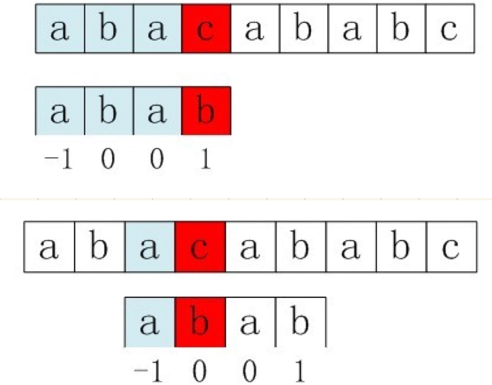

# 字符串匹配：BF 与 KMP

原 PDF 对应页：DataStructure.pdf 第 32-41 页。原文从定长字符串、BF 算法讲到 KMP 的 next 数组，并用病毒环状序列做练习。Python 版重点不是背 next 数组，而是理解“失败以后，模式串自己能告诉我们跳到哪里”。



## 一句话抓本质

BF 是主串和模式串不匹配就从头再试；KMP 是不匹配时利用模式串自身的前后缀信息，避免主串指针回退。

## BF 暴力匹配

```python
def brute_force_search(text: str, pattern: str) -> int:
    if pattern == "":
        return 0
    n, m = len(text), len(pattern)
    for start in range(n - m + 1):
        ok = True
        for j in range(m):
            if text[start + j] != pattern[j]:
                ok = False
                break
        if ok:
            return start
    return -1

print(brute_force_search("ababc", "abc"))
```

手推 text = ababc，pattern = abc：

| start | 比较过程 | 结果 |
|---:|---|---|
| 0 | a=a, b=b, a!=c | 失败 |
| 1 | b!=a | 失败 |
| 2 | a=a, b=b, c=c | 成功，返回 2 |

BF 好理解，但最坏 O(nm)。

## KMP 的核心：prefix 函数

prefix[i] 表示 pattern[0:i+1] 这段字符串中，最长的“相等真前缀和真后缀”的长度。

```python
def build_prefix(pattern: str) -> list[int]:
    prefix = [0] * len(pattern)
    j = 0
    for i in range(1, len(pattern)):
        while j > 0 and pattern[i] != pattern[j]:
            j = prefix[j - 1]
        if pattern[i] == pattern[j]:
            j += 1
        prefix[i] = j
    return prefix

print(build_prefix("ababaca"))
```

手推 pattern = ababaca：

| i | pattern[i] | j 变化 | prefix[i] |
|---:|---|---|---:|
| 1 | b | a != b | 0 |
| 2 | a | a == a | 1 |
| 3 | b | b == b | 2 |
| 4 | a | a == a | 3 |
| 5 | c | c != b，再退到 1，再退到 0 | 0 |
| 6 | a | a == a | 1 |

## KMP 搜索

```python
def kmp_search(text: str, pattern: str) -> int:
    if pattern == "":
        return 0
    prefix = build_prefix(pattern)
    j = 0
    for i, ch in enumerate(text):
        while j > 0 and ch != pattern[j]:
            j = prefix[j - 1]
        if ch == pattern[j]:
            j += 1
        if j == len(pattern):
            return i - len(pattern) + 1
    return -1

def build_prefix(pattern: str) -> list[int]:
    prefix = [0] * len(pattern)
    j = 0
    for i in range(1, len(pattern)):
        while j > 0 and pattern[i] != pattern[j]:
            j = prefix[j - 1]
        if pattern[i] == pattern[j]:
            j += 1
        prefix[i] = j
    return prefix

print(kmp_search("ababc", "abc"))
```

变量角色：

| 变量 | 角色 |
|---|---|
| i | 主串 text 当前下标，只往前走 |
| j | 模式串 pattern 当前匹配到的位置 |
| prefix | 模式串失败后应该退到哪里 |

## 环状病毒序列

原 PDF 里的病毒例子说：如果病毒串是环状的，那么 xyz、yzx、zxy 都算同一个环。常用技巧是把病毒串复制一遍。

```python
def is_rotation_match(virus: str, sample: str) -> bool:
    if len(virus) != len(sample):
        return False
    return kmp_search(virus + virus, sample) != -1

def kmp_search(text: str, pattern: str) -> int:
    if pattern == "":
        return 0
    prefix = build_prefix(pattern)
    j = 0
    for i, ch in enumerate(text):
        while j > 0 and ch != pattern[j]:
            j = prefix[j - 1]
        if ch == pattern[j]:
            j += 1
        if j == len(pattern):
            return i - len(pattern) + 1
    return -1

def build_prefix(pattern: str) -> list[int]:
    prefix = [0] * len(pattern)
    j = 0
    for i in range(1, len(pattern)):
        while j > 0 and pattern[i] != pattern[j]:
            j = prefix[j - 1]
        if pattern[i] == pattern[j]:
            j += 1
        prefix[i] = j
    return prefix

print(is_rotation_match("xyz", "zxy"))
```

## C 写法到 Python 写法

| C 语言笔记 | Python 写法 | 本质 |
|---|---|---|
| ch[1..length] | Python 字符串 0 下标 | 下标体系不同 |
| next 数组 | prefix 数组 | 失败后退的位置 |
| i 不回退 | for i, ch in enumerate(text) | 主串只扫一遍 |
| j = next[j] | j = prefix[j - 1] | 模式串自己回退 |

## 常见错法

错误 1：把 prefix 理解成“相同字符数量”。它不是统计字符数量，而是前缀和后缀的结构长度。

错误 2：KMP 失败时让 i 回退。KMP 的优势就在于 i 不回退。

错误 3：环状匹配忘记判断长度。sample 比 virus 长时，virus+virus 里也可能出现它的一段，但那不是同一个环。

## 题目信号

- 在长字符串中找模式串。
- 多次匹配同一个模式串。
- 字符串周期、循环同构、旋转匹配。
- 暴力双循环会超时。

## 验收练习

1. 手算 pattern = aabaaab 的 prefix 数组。
2. 写一个函数返回 pattern 在 text 中出现的所有起点。
3. 解释为什么 KMP 的复杂度是 O(n + m)。
