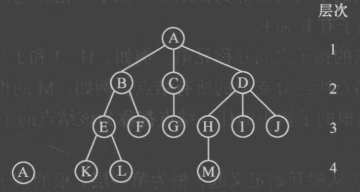

# 树、二叉树与森林

原 PDF 对应页：DataStructure.pdf 第 42-58 页。原文讲树的术语、二叉树性质、链式二叉树、递归/非递归遍历、层次遍历、复制、深度、节点数、树和森林转换。Python 版先抓住遍历，因为大多数刷题都从遍历开始。



## 一句话抓本质

树是没有环的层级结构；二叉树的每个节点最多两个孩子，遍历顺序决定了你什么时候处理当前节点。

## 二叉树节点

```python
from dataclasses import dataclass

@dataclass
class TreeNode:
    val: int
    left: "TreeNode | None" = None
    right: "TreeNode | None" = None
```

构造小树：

```text
      1
     / \
    2   3
   / \
  4   5
```

```python
from dataclasses import dataclass

@dataclass
class TreeNode:
    val: int
    left: "TreeNode | None" = None
    right: "TreeNode | None" = None

root = TreeNode(1,
    TreeNode(2, TreeNode(4), TreeNode(5)),
    TreeNode(3)
)
```

## 三种 DFS 遍历

```python
from dataclasses import dataclass

@dataclass
class TreeNode:
    val: int
    left: "TreeNode | None" = None
    right: "TreeNode | None" = None

def preorder(root: TreeNode | None) -> list[int]:
    if root is None:
        return []
    return [root.val] + preorder(root.left) + preorder(root.right)

def inorder(root: TreeNode | None) -> list[int]:
    if root is None:
        return []
    return inorder(root.left) + [root.val] + inorder(root.right)

def postorder(root: TreeNode | None) -> list[int]:
    if root is None:
        return []
    return postorder(root.left) + postorder(root.right) + [root.val]
```

变量角色：

| 遍历 | 当前节点处理时机 | 常见用途 |
|---|---|---|
| 先序 | 先处理根 | 复制树、序列化、表达式前缀 |
| 中序 | 左根右 | BST 输出有序序列 |
| 后序 | 最后处理根 | 删除树、统计子树信息 |

手推上面的小树：

| 遍历 | 结果 |
|---|---|
| 先序 | 1, 2, 4, 5, 3 |
| 中序 | 4, 2, 5, 1, 3 |
| 后序 | 4, 5, 2, 3, 1 |

## 非递归中序

```python
from dataclasses import dataclass

@dataclass
class TreeNode:
    val: int
    left: "TreeNode | None" = None
    right: "TreeNode | None" = None

def inorder_iter(root: TreeNode | None) -> list[int]:
    ans: list[int] = []
    stack: list[TreeNode] = []
    cur = root
    while cur is not None or stack:
        while cur is not None:
            stack.append(cur)
            cur = cur.left
        cur = stack.pop()
        ans.append(cur.val)
        cur = cur.right
    return ans
```

这段代码的关键是：先一路向左压栈，左边走完后弹出当前节点，再去右子树。

## 层序遍历 BFS

```python
from collections import deque
from dataclasses import dataclass

@dataclass
class TreeNode:
    val: int
    left: "TreeNode | None" = None
    right: "TreeNode | None" = None

def level_order(root: TreeNode | None) -> list[list[int]]:
    if root is None:
        return []
    ans: list[list[int]] = []
    q = deque([root])
    while q:
        level = []
        for _ in range(len(q)):
            node = q.popleft()
            level.append(node.val)
            if node.left is not None:
                q.append(node.left)
            if node.right is not None:
                q.append(node.right)
        ans.append(level)
    return ans
```

## 树的深度和节点数

```python
from dataclasses import dataclass

@dataclass
class TreeNode:
    val: int
    left: "TreeNode | None" = None
    right: "TreeNode | None" = None

def max_depth(root: TreeNode | None) -> int:
    if root is None:
        return 0
    return 1 + max(max_depth(root.left), max_depth(root.right))

def count_nodes(root: TreeNode | None) -> int:
    if root is None:
        return 0
    return 1 + count_nodes(root.left) + count_nodes(root.right)
```

## 森林转二叉树的理解

原 PDF 讲树、森林和二叉树互转。记住一句话：孩子兄弟表示法。

```text
left  指向第一个孩子
right 指向下一个兄弟
```

所以一棵普通树可以用二叉树节点存下来。竞赛里不常直接考转换公式，但这种思想会出现在“多叉树转二叉树”“文件目录树”里。

## 常见错法

错误 1：把空树深度写成 1。一般约定空树深度为 0，只有根节点深度为 1。

错误 2：层序遍历时直接 while q 里弹节点，却忘记按层分组。要按层输出时，必须先固定本层 len(q)。

错误 3：后序遍历没理解用途。只要一个节点的答案依赖左右子树，就常常是后序。

## 题目信号

- 求树高、节点数、路径和：DFS。
- 求每一层、最短层数：BFS。
- BST 第 k 小：中序。
- 删除、剪枝、判断平衡：后序。

## 验收练习

1. 手写一棵 5 个节点的树，给出三种 DFS 序列。
2. 写函数判断两棵树是否完全相同。
3. 写函数判断一棵树是否平衡：左右子树高度差不超过 1。
