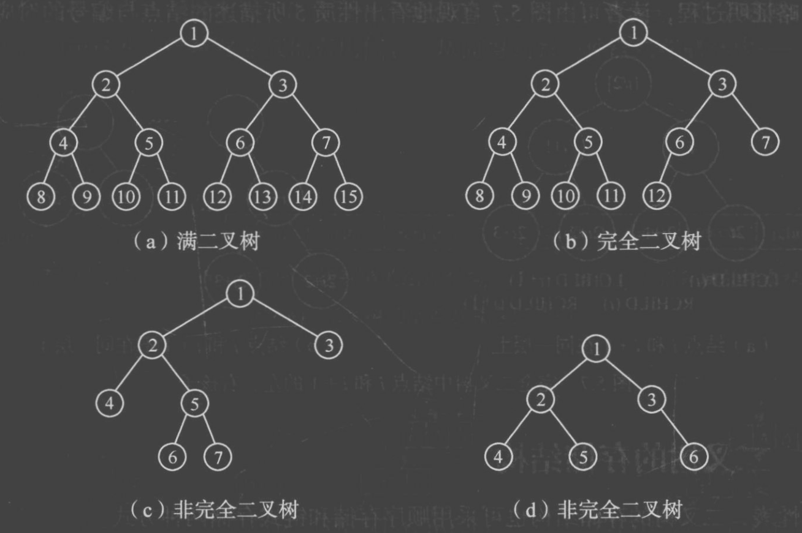
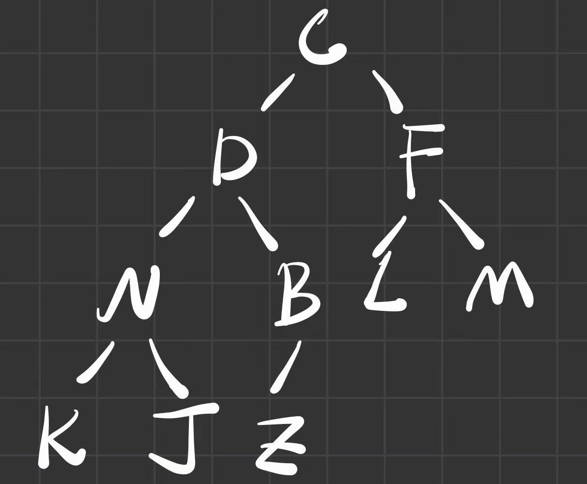

# 4. 树、二叉树、森林

**原 PDF 页码：** DataStructure.pdf P42-P58

## 4.1 原 PDF 小节

- 树的定义和基本术语
- 二叉树定义与性质
- 完全二叉树性质
- 链式二叉树存储结构
- 递归遍历与非递归遍历
- 先序创建二叉树、层次遍历、复制、深度、节点数、销毁
- 线索二叉树
- 树与森林的存储、转换和遍历

## 4.2 二叉树性质

第 i 层最多有：

$$
2^{i-1}\quad (i\ge 1)
$$

深度为 k 的二叉树最多有：

$$
2^k-1
$$

对任意非空二叉树，若叶子节点数为 n0，度为 2 的节点数为 n2，则：

$$
n_0=n_2+1
$$

完全二叉树按层编号时，节点 i 的关系：

$$
parent(i)=\left\lfloor \frac{i}{2}\right\rfloor
$$

$$
left(i)=2i,\quad right(i)=2i+1
$$

若使用 Python 0 下标数组，则变成：

$$
parent(i)=\left\lfloor \frac{i-1}{2}\right\rfloor,\quad left(i)=2i+1,\quad right(i)=2i+2
$$

## 4.3 原 PDF 图示





## 4.4 链式二叉树

```python
from dataclasses import dataclass

@dataclass
class TreeNode:
    data: int
    left: "TreeNode | None" = None
    right: "TreeNode | None" = None
```

## 4.5 三种递归遍历

$$
PreOrder: Root \rightarrow Left \rightarrow Right
$$

$$
InOrder: Left \rightarrow Root \rightarrow Right
$$

$$
PostOrder: Left \rightarrow Right \rightarrow Root
$$

```python
from dataclasses import dataclass

@dataclass
class TreeNode:
    data: int
    left: "TreeNode | None" = None
    right: "TreeNode | None" = None

def preorder(root: TreeNode | None) -> list[int]:
    if root is None:
        return []
    return [root.data] + preorder(root.left) + preorder(root.right)

def inorder(root: TreeNode | None) -> list[int]:
    if root is None:
        return []
    return inorder(root.left) + [root.data] + inorder(root.right)

def postorder(root: TreeNode | None) -> list[int]:
    if root is None:
        return []
    return postorder(root.left) + postorder(root.right) + [root.data]
```

## 4.6 非递归中序遍历

```python
from dataclasses import dataclass

@dataclass
class TreeNode:
    data: int
    left: "TreeNode | None" = None
    right: "TreeNode | None" = None

def inorder_iter(root: TreeNode | None) -> list[int]:
    stack: list[TreeNode] = []
    ans: list[int] = []
    p = root
    while p is not None or stack:
        while p is not None:
            stack.append(p)
            p = p.left
        p = stack.pop()
        ans.append(p.data)
        p = p.right
    return ans
```

## 4.7 层次遍历

原 PDF 的层次遍历依赖队列。

```python
from collections import deque
from dataclasses import dataclass

@dataclass
class TreeNode:
    data: int
    left: "TreeNode | None" = None
    right: "TreeNode | None" = None

def level_order(root: TreeNode | None) -> list[list[int]]:
    if root is None:
        return []
    q = deque([root])
    ans: list[list[int]] = []
    while q:
        level = []
        for _ in range(len(q)):
            node = q.popleft()
            level.append(node.data)
            if node.left:
                q.append(node.left)
            if node.right:
                q.append(node.right)
        ans.append(level)
    return ans
```

## 4.8 深度与节点数

递归定义：

$$
Depth(T)=\begin{cases}
0,&T=\varnothing\\
1+\max(Depth(T_l),Depth(T_r)),&T\ne\varnothing
\end{cases}
$$

```python
from dataclasses import dataclass

@dataclass
class TreeNode:
    data: int
    left: "TreeNode | None" = None
    right: "TreeNode | None" = None

def depth(root: TreeNode | None) -> int:
    if root is None:
        return 0
    return 1 + max(depth(root.left), depth(root.right))

def count_nodes(root: TreeNode | None) -> int:
    if root is None:
        return 0
    return 1 + count_nodes(root.left) + count_nodes(root.right)
```

## 4.9 树、森林与二叉树转换

原 PDF 使用“孩子兄弟表示法”：

| 指针 | 含义 |
|---|---|
| left | 第一个孩子 |
| right | 下一个兄弟 |

因此普通树或森林可以转换成二叉树结构保存。记忆式：

$$
左指孩子，右指兄弟
$$
