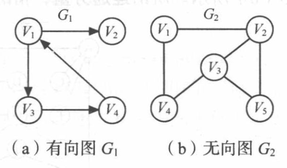

# 5. 哈夫曼树与哈夫曼编码

**原 PDF 页码：** DataStructure.pdf P59-P66

## 5.1 原 PDF 小节

- 术语
- 最优二叉树
- 构造哈夫曼树 step 和定理
- 哈夫曼编码
- 代码实现

## 5.2 术语与公式

带权路径长度 WPL：

$$
WPL=\sum_{i=1}^{n}w_i l_i
$$

其中 wi 是第 i 个叶子节点的权值，li 是从根到该叶子的路径长度。

哈夫曼树是使 WPL 最小的二叉树，又叫最优二叉树。

## 5.3 原 PDF 图示




## 5.4 构造规则

每次选择权值最小的两棵树合并：

$$
new.weight = left.weight + right.weight
$$

重复直到只剩一棵树。

手算例子：权值 1,2,3,7。

| 步骤 | 取出 | 合并 | 剩余权值 |
|---|---|---|---|
| 1 | 1, 2 | 3 | 3, 3, 7 |
| 2 | 3, 3 | 6 | 6, 7 |
| 3 | 6, 7 | 13 | 13 |

## 5.5 Python 复现

```python
from dataclasses import dataclass
from heapq import heapify, heappop, heappush
from itertools import count

@dataclass
class HuffmanNode:
    weight: int
    char: str | None = None
    left: "HuffmanNode | None" = None
    right: "HuffmanNode | None" = None

def build_huffman(freq: dict[str, int]) -> HuffmanNode:
    order = count()
    heap = [(w, next(order), HuffmanNode(w, ch)) for ch, w in freq.items()]
    heapify(heap)
    while len(heap) > 1:
        w1, _, left = heappop(heap)
        w2, _, right = heappop(heap)
        parent = HuffmanNode(w1 + w2, None, left, right)
        heappush(heap, (parent.weight, next(order), parent))
    return heap[0][2]
```

## 5.6 哈夫曼编码

通常约定左分支为 0，右分支为 1。

```python
def make_codes(root: HuffmanNode) -> dict[str, str]:
    codes: dict[str, str] = {}

    def dfs(node: HuffmanNode, path: str) -> None:
        if node.char is not None:
            codes[node.char] = path or "0"
            return
        if node.left is not None:
            dfs(node.left, path + "0")
        if node.right is not None:
            dfs(node.right, path + "1")

    dfs(root, "")
    return codes
```

哈夫曼编码是前缀编码：不存在某个字符编码是另一个字符编码的前缀。

## 5.7 复杂度

若有 n 个不同字符，用堆实现构造：

$$
T(n)=O(n\log n)
$$

编码 DFS：

$$
T(n)=O(n)
$$
