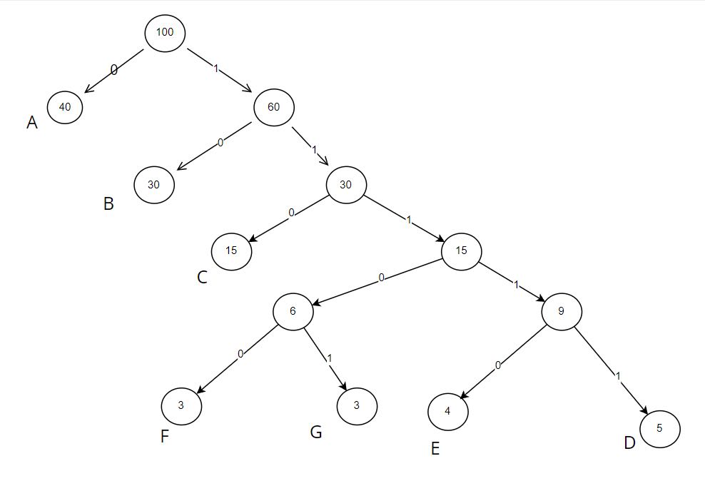

# 哈夫曼树与编码

原 PDF 对应页：DataStructure.pdf 第 59-66 页。原文讲带权路径长度、最优二叉树、构造哈夫曼树和哈夫曼编码。Python 版要抓住两点：每次合并最小的两个权值；用 heapq 自然实现。



## 一句话抓本质

哈夫曼树是一种贪心：让出现频率高的字符离根更近，让出现频率低的字符离根更远，从而让总编码长度最小。

## 带权路径长度

如果字符 A 出现 5 次，编码长度是 2，那么它贡献 5 × 2 = 10。所有字符贡献加起来，就是总编码成本。

| 字符 | 频率 | 编码 | 长度 | 贡献 |
|---|---:|---|---:|---:|
| A | 5 | 0 | 1 | 5 |
| B | 2 | 10 | 2 | 4 |
| C | 1 | 11 | 2 | 2 |

高频字符应该短。

## 构造哈夫曼树

```python
from dataclasses import dataclass
from heapq import heappop, heappush, heapify
from itertools import count

@dataclass
class HuffmanNode:
    weight: int
    char: str | None = None
    left: "HuffmanNode | None" = None
    right: "HuffmanNode | None" = None

def build_huffman_tree(freq: dict[str, int]) -> HuffmanNode:
    order = count()
    heap = [(w, next(order), HuffmanNode(w, ch)) for ch, w in freq.items()]
    heapify(heap)
    if len(heap) == 1:
        return heap[0][2]
    while len(heap) > 1:
        w1, _, a = heappop(heap)
        w2, _, b = heappop(heap)
        parent = HuffmanNode(w1 + w2, None, a, b)
        heappush(heap, (parent.weight, next(order), parent))
    return heap[0][2]
```

为什么要有 order？heapq 比较元组时，如果 weight 相同，会继续比较后面的元素。节点对象不能直接比较，所以加一个递增编号打破平局。

## 生成编码表

```python
from dataclasses import dataclass

@dataclass
class HuffmanNode:
    weight: int
    char: str | None = None
    left: "HuffmanNode | None" = None
    right: "HuffmanNode | None" = None

def build_codes(root: HuffmanNode) -> dict[str, str]:
    codes: dict[str, str] = {}

    def dfs(node: HuffmanNode, path: str) -> None:
        if node.char is not None:
            codes[node.char] = path or "0"
            return
        if node.left is not None:
            dfs(node.left, path + "0")
        if node.right is not None:
            dfs(node.right, path + "1")

    dfs(root, "")
    return codes
```

## 完整示例

```python
from collections import Counter
from dataclasses import dataclass
from heapq import heappop, heappush, heapify
from itertools import count

@dataclass
class HuffmanNode:
    weight: int
    char: str | None = None
    left: "HuffmanNode | None" = None
    right: "HuffmanNode | None" = None

def build_huffman_tree(freq: dict[str, int]) -> HuffmanNode:
    order = count()
    heap = [(w, next(order), HuffmanNode(w, ch)) for ch, w in freq.items()]
    heapify(heap)
    if len(heap) == 1:
        return heap[0][2]
    while len(heap) > 1:
        w1, _, a = heappop(heap)
        w2, _, b = heappop(heap)
        parent = HuffmanNode(w1 + w2, None, a, b)
        heappush(heap, (parent.weight, next(order), parent))
    return heap[0][2]

def build_codes(root: HuffmanNode) -> dict[str, str]:
    codes: dict[str, str] = {}
    def dfs(node: HuffmanNode, path: str) -> None:
        if node.char is not None:
            codes[node.char] = path or "0"
            return
        if node.left is not None:
            dfs(node.left, path + "0")
        if node.right is not None:
            dfs(node.right, path + "1")
    dfs(root, "")
    return codes

text = "aaabbc"
freq = dict(Counter(text))
root = build_huffman_tree(freq)
print(build_codes(root))
```

## 手算合并过程

freq = {A: 5, B: 2, C: 1, D: 1}

| 步骤 | 取出最小两个 | 合并后放回 | 堆中权值 |
|---|---|---|---|
| 1 | C=1, D=1 | CD=2 | 2, 2, 5 |
| 2 | B=2, CD=2 | BCD=4 | 4, 5 |
| 3 | BCD=4, A=5 | root=9 | 9 |

A 权值最大，离根通常更近。

## C 写法到 Python 写法

| C 语言笔记 | Python 写法 | 本质 |
|---|---|---|
| 反复找最小两个结点 | heapq | 最小值优先队列 |
| parent、lchild、rchild 下标 | node.left、node.right | 树结构关系 |
| 编码数组 | 字符串 path | 左 0 右 1 |

## 常见错法

错误 1：每次不是取最小两个，而是随便合并。哈夫曼最优性依赖这个贪心选择。

错误 2：只有一个字符时编码为空串。实际编码至少给它一个 0。

错误 3：编码不是前缀码。哈夫曼树从根到叶子的路径天然保证一个字符编码不会是另一个字符编码的前缀。

## 题目信号

- 合并代价最小。
- 每次合并两个最小值。
- 最优二叉树、带权路径长度。
- 文件压缩、编码长度最小。

## 验收练习

1. 手算权值 2、3、7、9 的哈夫曼合并过程。
2. 写函数计算编码后的总长度。
3. 解释哈夫曼为什么是贪心，而不是动态规划。
