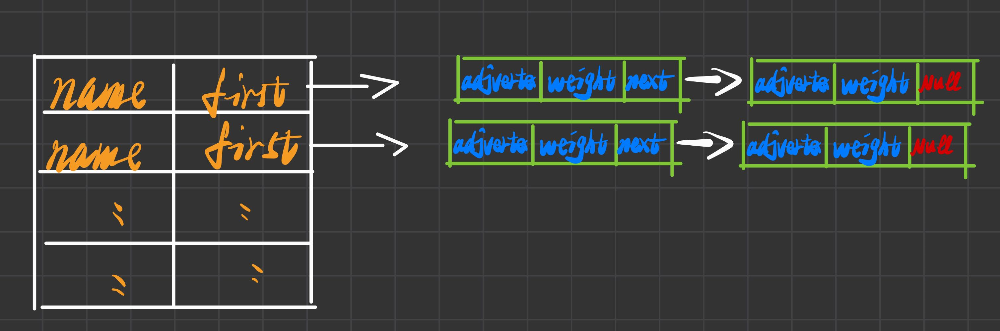
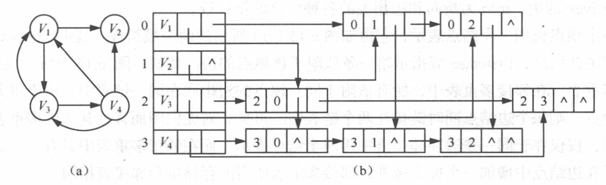

# 6. 图的表示、DFS、BFS

**原 PDF 页码：** DataStructure.pdf P67-P78

## 6.1 原 PDF 小节

- 图的定义和术语
- 完全图、稀疏图、稠密图
- 度、路径、连通图、连通分量、生成树
- 邻接矩阵、邻接表、十字链表、邻接多重链表
- DFS、BFS 及算法效率

## 6.2 图的基本公式

无向完全图边数：

$$
E=\frac{n(n-1)}{2}
$$

有向完全图边数：

$$
E=n(n-1)
$$

无向图所有顶点度数之和：

$$
\sum_{v\in V}degree(v)=2E
$$

有向图：

$$
\sum indegree(v)=\sum outdegree(v)=E
$$

## 6.3 原 PDF 图示





## 6.4 邻接矩阵

邻接矩阵 A：

$$
A[i][j]=\begin{cases}
1,&(i,j)\in E\\
0,&(i,j)\notin E
\end{cases}
$$

带权图中：

$$
A[i][j]=w(i,j)
$$

Python 复现：

```python
def adjacency_matrix(n: int, edges: list[tuple[int, int]]) -> list[list[int]]:
    matrix = [[0] * n for _ in range(n)]
    for u, v in edges:
        matrix[u][v] = 1
        matrix[v][u] = 1
    return matrix
```

## 6.5 邻接表

邻接表记录每个顶点能直接到达的顶点。

```python
def adjacency_list(n: int, edges: list[tuple[int, int]]) -> list[list[int]]:
    graph = [[] for _ in range(n)]
    for u, v in edges:
        graph[u].append(v)
        graph[v].append(u)
    return graph
```

| 表示法 | 空间 | 查边 | 遍历邻居 |
|---|---:|---:|---:|
| 邻接矩阵 | O(n^2) | O(1) | O(n) |
| 邻接表 | O(n+E) | O(degree) | O(degree) |

## 6.6 DFS

```python
def dfs(graph: list[list[int]], start: int) -> list[int]:
    visited = [False] * len(graph)
    order: list[int] = []

    def visit(u: int) -> None:
        visited[u] = True
        order.append(u)
        for v in graph[u]:
            if not visited[v]:
                visit(v)

    visit(start)
    return order
```

邻接表 DFS 复杂度：

$$
T=O(V+E)
$$

邻接矩阵 DFS 复杂度：

$$
T=O(V^2)
$$

## 6.7 BFS

```python
from collections import deque

def bfs(graph: list[list[int]], start: int) -> list[int]:
    visited = [False] * len(graph)
    q = deque([start])
    visited[start] = True
    order: list[int] = []
    while q:
        u = q.popleft()
        order.append(u)
        for v in graph[u]:
            if not visited[v]:
                visited[v] = True
                q.append(v)
    return order
```

BFS 用队列，适合层次遍历和无权图最短路径。

## 6.8 连通分量

```python
def component_count(graph: list[list[int]]) -> int:
    visited = [False] * len(graph)

    def visit(u: int) -> None:
        visited[u] = True
        for v in graph[u]:
            if not visited[v]:
                visit(v)

    count = 0
    for i in range(len(graph)):
        if not visited[i]:
            count += 1
            visit(i)
    return count
```
