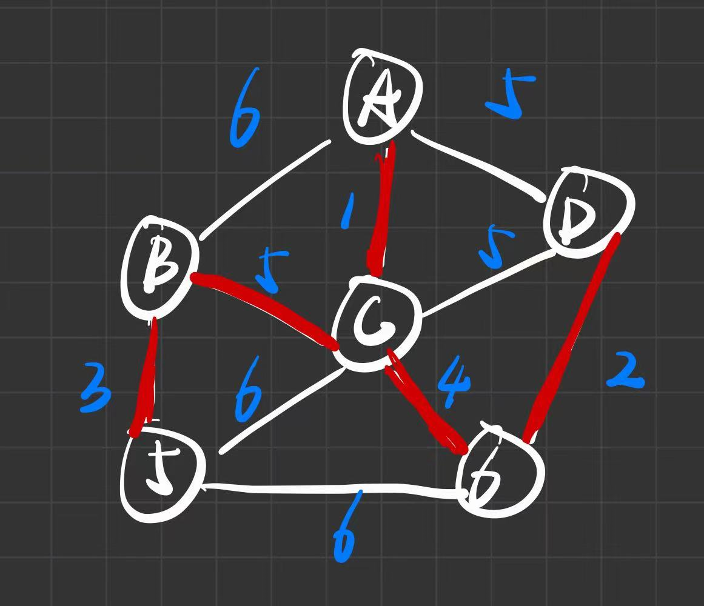

# 7. 最小生成树：Prim 与 Kruskal

**原 PDF 页码：** DataStructure.pdf P79-P86

## 7.1 原 PDF 小节

- Spanning Tree
- Prim 算法：邻接矩阵、邻接表实现
- Kruskal 算法：邻接矩阵、邻接表实现

## 7.2 生成树与最小生成树

连通无向图 G=(V,E) 的生成树包含全部顶点，且没有环。

若顶点数为 n，生成树边数必为：

$$
|E_T|=n-1
$$

最小生成树满足：

$$
W(T)=\sum_{e\in T}w(e) \quad \text{最小}
$$

## 7.3 原 PDF 图示



## 7.4 Prim 算法

Prim 从一个顶点开始，每次选一条从已选点集到未选点集的最小边。

$$
U \leftarrow U\cup \{v\}
$$

$$
lowcost[x]=\min(lowcost[x],w(v,x))
$$

Python 用堆复现：

```python
from heapq import heappop, heappush

def prim(n: int, edges: list[tuple[int, int, int]]) -> int | None:
    graph = [[] for _ in range(n)]
    for u, v, w in edges:
        graph[u].append((w, v))
        graph[v].append((w, u))

    visited = [False] * n
    heap = [(0, 0)]
    total = 0
    cnt = 0
    while heap:
        w, u = heappop(heap)
        if visited[u]:
            continue
        visited[u] = True
        total += w
        cnt += 1
        for nw, v in graph[u]:
            if not visited[v]:
                heappush(heap, (nw, v))
    return total if cnt == n else None
```

## 7.5 Kruskal 算法

Kruskal 按边权从小到大选边，只要不形成环就加入生成树。

并查集判断是否成环：

$$
find(u)=find(v) \Rightarrow u,v \text{ 已连通，加入会成环}
$$

```python
class DSU:
    def __init__(self, n: int):
        self.parent = list(range(n))
        self.size = [1] * n

    def find(self, x: int) -> int:
        if self.parent[x] != x:
            self.parent[x] = self.find(self.parent[x])
        return self.parent[x]

    def union(self, a: int, b: int) -> bool:
        ra, rb = self.find(a), self.find(b)
        if ra == rb:
            return False
        if self.size[ra] < self.size[rb]:
            ra, rb = rb, ra
        self.parent[rb] = ra
        self.size[ra] += self.size[rb]
        return True

def kruskal(n: int, edges: list[tuple[int, int, int]]) -> int | None:
    dsu = DSU(n)
    total = 0
    used = 0
    for u, v, w in sorted(edges, key=lambda x: x[2]):
        if dsu.union(u, v):
            total += w
            used += 1
    return total if used == n - 1 else None
```

## 7.6 复杂度

| 算法 | 常见实现 | 复杂度 |
|---|---|---:|
| Prim 邻接矩阵 | 扫描最小 lowcost | O(V^2) |
| Prim 邻接表 + 堆 | 优先队列 | O(E log V) |
| Kruskal | 排序 + 并查集 | O(E log E) |
