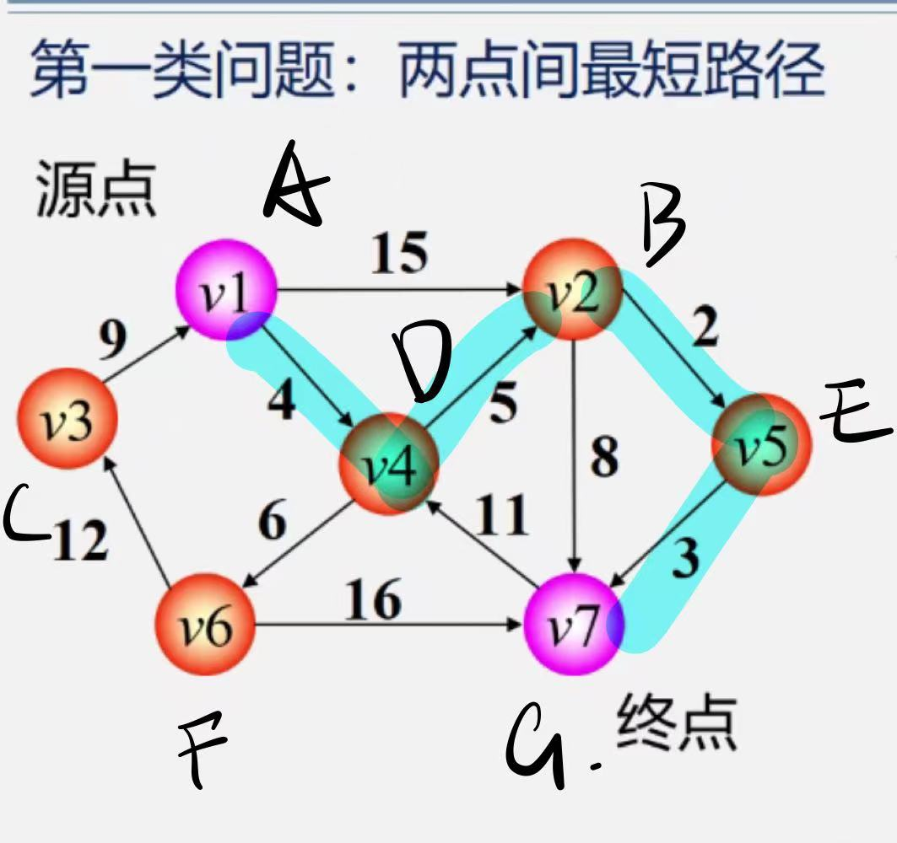
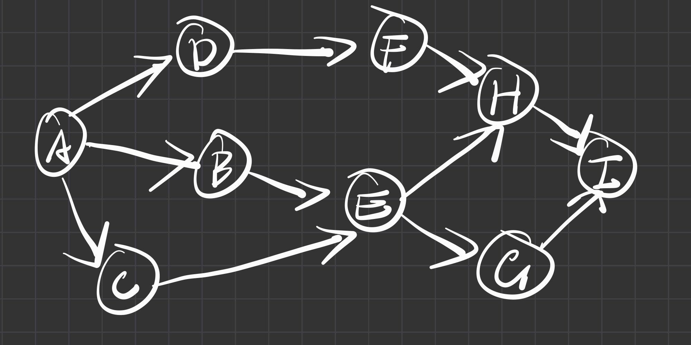
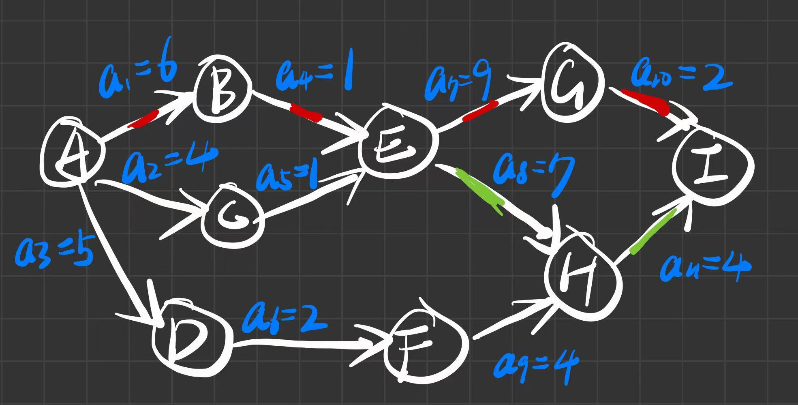

# 8. 最短路径、拓扑排序、关键路径

**原 PDF 页码：** DataStructure.pdf P87-P99

## 8.1 原 PDF 小节

- Dijkstra 算法
- Floyd 算法
- 有向无环图 DAG
- AOV 与 AOE
- 拓扑排序
- 关键路径

## 8.2 Dijkstra 算法

适用条件：边权非负。

松弛公式：

$$
dist[v]=\min(dist[v],dist[u]+w(u,v))
$$



```python
from heapq import heappop, heappush

def dijkstra(n: int, edges: list[tuple[int, int, int]], start: int) -> list[float]:
    graph = [[] for _ in range(n)]
    for u, v, w in edges:
        graph[u].append((v, w))

    dist = [float("inf")] * n
    dist[start] = 0
    heap = [(0, start)]
    while heap:
        d, u = heappop(heap)
        if d != dist[u]:
            continue
        for v, w in graph[u]:
            nd = d + w
            if nd < dist[v]:
                dist[v] = nd
                heappush(heap, (nd, v))
    return dist
```

复杂度：

$$
T=O(E\log V)
$$

## 8.3 Floyd 算法

Floyd 用于求任意两点间最短路径。核心是枚举中转点 k：

$$
D[i][j]=\min(D[i][j],D[i][k]+D[k][j])
$$



```python
def floyd(n: int, edges: list[tuple[int, int, int]]) -> list[list[float]]:
    dist = [[float("inf")] * n for _ in range(n)]
    for i in range(n):
        dist[i][i] = 0
    for u, v, w in edges:
        dist[u][v] = min(dist[u][v], w)

    for k in range(n):
        for i in range(n):
            for j in range(n):
                dist[i][j] = min(dist[i][j], dist[i][k] + dist[k][j])
    return dist
```

复杂度：

$$
T=O(V^3),\quad S=O(V^2)
$$

## 8.4 拓扑排序

AOV 网中，顶点表示活动，边表示先后依赖。拓扑排序每次取入度为 0 的点。

```python
from collections import deque

def topological_sort(n: int, edges: list[tuple[int, int]]) -> list[int] | None:
    graph = [[] for _ in range(n)]
    indeg = [0] * n
    for u, v in edges:
        graph[u].append(v)
        indeg[v] += 1

    q = deque([i for i in range(n) if indeg[i] == 0])
    order: list[int] = []
    while q:
        u = q.popleft()
        order.append(u)
        for v in graph[u]:
            indeg[v] -= 1
            if indeg[v] == 0:
                q.append(v)
    return order if len(order) == n else None
```

## 8.5 关键路径公式

AOE 网中，边表示活动，顶点表示事件。

事件最早发生时间：

$$
ve[j]=\max(ve[i]+w(i,j))
$$

事件最迟发生时间：

$$
vl[i]=\min(vl[j]-w(i,j))
$$

活动最早开始时间：

$$
e(i,j)=ve[i]
$$

活动最迟开始时间：

$$
l(i,j)=vl[j]-w(i,j)
$$

关键活动满足：

$$
e(i,j)=l(i,j)
$$


