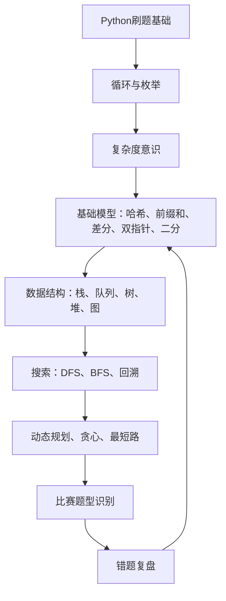

# Python算法知识地图

这张图是你学习时的“大面”。不要把算法看成一堆词，要看成一条能力链。

## 一句话总览

- Python 基础解决“我能不能把想法写出来”。
- 复杂度解决“这个方法能不能跑”。
- 数据结构解决“数据怎么放才方便操作”。
- 算法模型解决“这类题通常怎么想”。
- 复盘解决“下次怎么更快识别出来”。

## 你应该怎么在脑子里连线

看到“统计次数”，连到 [[dict字典与哈希]] 和 [[哈希计数]]。

看到“连续一段”“区间求和”，连到 [[前缀和]]。

看到“多次区间加法”，连到 [[差分]]。

看到“两个下标一起移动”，连到 [[双指针]] 或 [[滑动窗口]]。

看到“满足条件的最小/最大答案”，连到 [[二分答案]]。

看到“从一个状态走到别的状态”，连到 [[DFS]] / [[BFS]] / [[动态规划]]。
